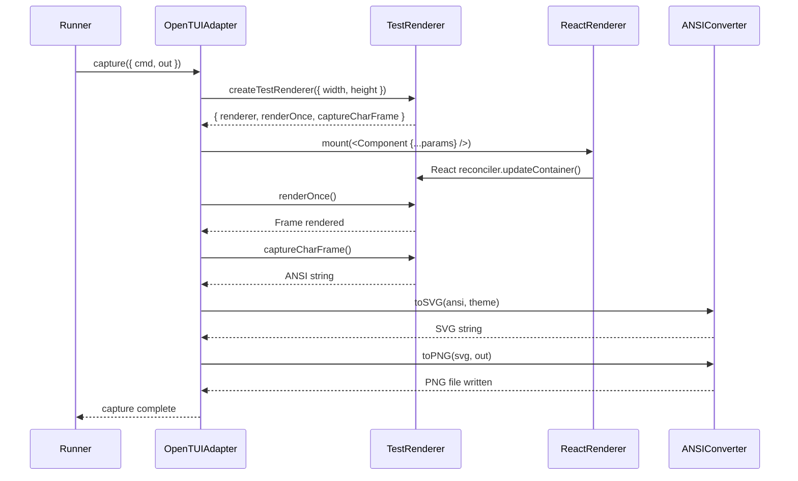
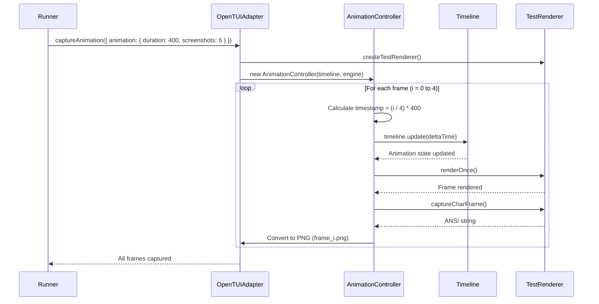

# PRD: OpenTUI Native Test Adapter with Animation Support

**Version**: 2.0
**Status**: Draft for Review
**Author**: AI Architect
**Target Audience**: LLM Implementation Agent

---

## 1. Executive Summary

Replace platform-specific terminal capture adapters (macOS Terminal.app, Browser+PTY) with a pure TypeScript solution using `@opentui/core/testing`. Eliminate native dependencies (`node-pty`, Playwright) to enable fast, cross-platform component screenshot testing with animation frame capture for LLM visual evaluation.

**Key Goals:**
- ✅ Remove all native module dependencies
- ✅ Support multi-frame animation capture
- ✅ 10x faster test execution (no browser startup)
- ✅ Cross-platform by default
- ✅ Maintain LLM evaluation compatibility

**Migration Strategy:**
This PRD follows a **safe, phased approach**:
1. Build new adapter alongside existing system (no breaking changes)
2. Validate 100% of existing tests pass with new adapter
3. Add animation support and test
4. **Only after full validation** → Remove old adapters and dependencies

**Critical Safety Gate**: Old adapters will NOT be deleted until Phase 3 validation proves the new system works for all test cases.

---

## 2. Current System Analysis

### 2.1 Existing Architecture

**File References:**
- Testing README: `src/testing/README.md:1-1088`
- Main Types: `src/testing/types.ts:1-26`
- Adapter Interface: `src/testing/capture/adapters/types.ts:1-38`
- Terminal Facade: `src/testing/capture/terminal.ts:1-69`

**Current Adapter Stack:**

```
┌─────────────────────────────────────┐
│      captureTerminal()              │  Facade (terminal.ts:17)
└──────────────┬──────────────────────┘
               │
       ┌───────┴────────┐
       │                │
   ┌───▼────┐    ┌─────▼──────┐
   │ macOS  │    │  Browser   │
   │Adapter │    │  Adapter   │
   └───┬────┘    └─────┬──────┘
       │                │
  ┌────▼──────┐   ┌────▼─────────┐
  │AppleScript│   │ Playwright   │
  │screencap  │   │ + xterm.js   │
  └────┬──────┘   │ + node-pty   │
       │          └────┬──────────┘
       │               │
  ┌────▼───────────────▼─────┐
  │   Native Modules         │
  │  (Platform-Specific)     │
  └──────────────────────────┘
```

**Problems:**
- macOS adapter: `src/testing/capture/adapters/macos.ts:1-118` (AppleScript, screen permissions required)
- Browser adapter: `src/testing/capture/adapters/browser.ts:1-210` + `pty-helper.ts:1-167` (Playwright + node-pty)
- Both require heavy native dependencies
- No animation support (single frame only)

---

## 3. Proposed Architecture

### 3.1 New System Design

```
┌─────────────────────────────────────────────────┐
│         captureComponent()                      │  New API
└──────────────────┬──────────────────────────────┘
                   │
         ┌─────────▼────────────┐
         │ OpenTUITestAdapter   │  Pure TypeScript
         └─────────┬────────────┘
                   │
    ┌──────────────┼──────────────┐
    │              │              │
┌───▼───┐   ┌──────▼──────┐  ┌──▼─────┐
│ React │   │  Timeline   │  │ ANSI   │
│Render │   │  Control    │  │ to PNG │
└───┬───┘   └──────┬──────┘  └──┬─────┘
    │              │             │
┌───▼──────────────▼─────────────▼───┐
│    @opentui/core/testing           │
│  ✓ No native modules               │
│  ✓ Animation control               │
│  ✓ Frame capture                   │
└────────────────────────────────────┘
```

### 3.2 Core Classes

```typescript
// src/testing/capture/adapters/opentui.ts

class OpenTUITestAdapter implements TerminalCaptureAdapter {
  async capture(options: CaptureOptions): Promise<void>
  isSupported(): boolean
  getName(): string

  // NEW: Animation support
  async captureAnimation(options: AnimationCaptureOptions): Promise<void>
}

class ReactRenderer {
  constructor(testRenderer: TestRenderer)
  async mount(component: ReactNode): Promise<void>
  async renderFrame(): Promise<void>
  captureANSI(): string
}

class ANSIConverter {
  constructor(theme: TerminalTheme)
  async toSVG(ansi: string): Promise<string>
  async toPNG(svg: string, output: string): Promise<void>
}

class AnimationController {
  constructor(timeline: Timeline, engine: TimelineEngine)
  async captureFrames(duration: number, count: number): Promise<string[]>
  private scheduleFrame(index: number, totalFrames: number): number
}
```

### 3.3 Type Definitions

```typescript
// Extension to src/testing/capture/adapters/types.ts

export type AnimationConfig = {
  /** Total animation duration in milliseconds */
  duration: number;
  /** Number of frames to capture over the duration */
  screenshots: number;
};

export type AnimationCaptureOptions = TerminalCaptureOptions & {
  animation: AnimationConfig;
  /** Base filename (frames will be suffixed: base_frame_0.png) */
  baseFilename: string;
};

export type TerminalTheme = {
  colors: Record<string, string>;
  fontSize: number;
  fontFamily: string;
  backgroundColor: string;
};

// Extension to src/testing/types.ts

export type ScreenshotMetadata = {
  // ... existing fields ...

  // NEW: Animation metadata
  animation?: {
    duration: number;
    frameCount: number;
    frameIndex: number;  // Which frame this is (0-based)
    timestamp: number;   // ms since animation start
  };
};
```

### 3.4 Setup File Schema Extension

```typescript
// src/components/agent-spinner/agent-spinner.setup.ts

export type ComponentScenario = {
  scenarioName: string;
  description: string;
  expectation: string;
  params: Record<string, unknown>;

  // NEW: Optional animation config
  animation?: {
    duration: number;     // e.g., 400ms
    screenshots: number;  // e.g., 5 frames
  };
};

// Example usage:
{
  scenarioName: "loading-animation",
  expectation: "Spinner rotates and counter animates from 0 to 500",
  params: { tokensUsed: 500, tokensMax: 1000 },
  animation: { duration: 400, screenshots: 5 }
  // → Captures: frame_0.png (0ms), frame_1.png (100ms), ..., frame_4.png (400ms)
}
```

---

## 4. Sequence Diagrams

### 4.1 Single Frame Capture (Static)



### 4.2 Animation Frame Capture



---

## 5. Implementation Strategy

### 5.1 Phase 1: Build New Adapter (Alongside Old System)

**Create new adapter WITHOUT modifying existing tests:**

1. **New files** (zero modifications to existing code):
   ```
   src/testing/capture/adapters/
   ├── opentui.ts            ← NEW: Core adapter
   ├── react-renderer.ts     ← NEW: React integration
   ├── ansi-converter.ts     ← NEW: ANSI → PNG
   └── animation-controller.ts ← NEW: Frame timing
   ```

2. **Dependencies to add** (`package.json`):
   ```json
   {
     "devDependencies": {
       "ansi-to-svg": "^1.4.3",
       "sharp": "^0.33.0"
     }
   }
   ```

3. **Update adapter list** (`src/testing/capture/terminal.ts:19`):
   ```typescript
   const adapters = [
     new OpenTUITestAdapter(), // ← Add first (highest priority)
     new MacOSTerminalAdapter(),
     new BrowserTerminalAdapter()
   ];
   ```

**Validation**: Run `bun test` - all existing tests should pass using new adapter automatically.

### 5.2 Phase 2: Add Animation Support

**Extend types and runner for animation capture:**

1. **Update types** (`src/testing/types.ts:5-17`):
   - Add `animation?: AnimationConfig` to scenario schema
   - Add `animation?: AnimationMetadata` to `ScreenshotMetadata`
   - Maintain full backward compatibility (undefined = single frame)

2. **Update runner** (`src/testing/capture/runner.ts:39-150`):
   - Detect `animation` field in setup files
   - Call `captureAnimation()` if present, else `capture()`
   - Generate one metadata entry per frame

3. **Update adapter interface** (`src/testing/capture/adapters/types.ts:22-37`):
   ```typescript
   export interface TerminalCaptureAdapter {
     capture(options: TerminalCaptureOptions): Promise<void>
     captureAnimation?(options: AnimationCaptureOptions): Promise<void> // ← NEW
     isSupported(): boolean
     getName(): string
   }
   ```

**Validation**: Add animation config to one test scenario, verify frames captured correctly.

### 5.3 Phase 3: Migrate All Existing Tests

**⚠️ CRITICAL: Do NOT delete old adapters yet**

**Goal**: Prove new adapter works for 100% of test cases.

1. **Run full test suite**:
   ```bash
   bun test
   ```
   Verify all tests pass with new adapter.

2. **Visual comparison**:
   - Capture baseline screenshots with old system
   - Re-capture with new adapter
   - Compare side-by-side for visual parity (95%+ similarity expected)

3. **Add animation tests**:
   - Update `agent-spinner.setup.ts` to include animation configs
   - Verify animation frames captured at correct intervals
   - Test LLM evaluation on animation sequences

4. **Performance benchmark**:
   ```bash
   time bun test  # Should be <10s vs 30-60s previously
   ```

5. **Cross-platform validation**:
   - Test on macOS, Linux (if available)
   - Verify no platform-specific issues

**Success Criteria**:
- ✅ All 100% of existing tests pass
- ✅ Screenshots visually match old system (>95% similarity)
- ✅ Animation capture working for test scenarios
- ✅ Performance improvement achieved (>10x faster)
- ✅ No native module errors (node-pty, Playwright not loaded)

**Only proceed to Phase 4 after all criteria met.**

### 5.4 Phase 4: Deprecation & Cleanup

**⚠️ ONLY after Phase 3 validation passes**

**Goal**: Remove legacy code and dependencies.

1. **Remove old adapters**:
   ```
   src/testing/capture/adapters/
   ├── macos.ts              ← DELETE
   ├── browser.ts            ← DELETE
   ├── browser.test.ts       ← DELETE
   ├── integration.test.ts   ← DELETE
   ├── pty-helper.ts         ← DELETE
   └── terminal-template.html ← DELETE
   ```

2. **Clean adapter list** (`src/testing/capture/terminal.ts:19`):
   ```typescript
   const adapters = [
     new OpenTUITestAdapter(), // Only adapter remaining
   ];
   ```

3. **Remove native dependencies** (`package.json:24-29`):
   ```diff
   - "node-pty": "^1.0.0",
   - "playwright": "^1.55.1",
   - "xterm": "^5.3.0",
   - "xterm-addon-fit": "^0.8.0"
   ```

4. **Update documentation** (`src/testing/README.md`):
   - Remove macOS-specific instructions (lines 737-785)
   - Update adapter section (lines 354-370)
   - Add animation testing guide

5. **Final validation**:
   ```bash
   rm -rf node_modules bun.lockb
   bun install
   bun test
   ```
   Verify everything still works after dependency removal.

---

## 6. Configuration Examples

### 6.1 Static Screenshot (Backward Compatible)

```typescript
// src/components/banner/banner.setup.ts
export default {
  scenarios: [
    {
      scenarioName: "default",
      expectation: "Shows welcome banner",
      params: { message: "Hello" }
      // No animation field = single screenshot (backward compatible)
    }
  ]
};
```

### 6.2 Animation Capture

```typescript
// src/components/agent-spinner/agent-spinner.setup.ts
export default {
  scenarios: [
    {
      scenarioName: "loading",
      expectation: "Spinner rotates smoothly, counter animates 0→500",
      params: { tokensUsed: 500, tokensMax: 1000 },
      animation: {
        duration: 400,    // 400ms total
        screenshots: 5    // Capture at: 0, 100, 200, 300, 400ms
      }
    }
  ]
};
```

**Output:**
```
.dev/reports/screenshots/
├── agent-spinner-loading_frame_0.png  (0ms)
├── agent-spinner-loading_frame_1.png  (100ms)
├── agent-spinner-loading_frame_2.png  (200ms)
├── agent-spinner-loading_frame_3.png  (300ms)
└── agent-spinner-loading_frame_4.png  (400ms)
```

---

## 7. LLM Evaluation Integration

### 7.1 Metadata Updates

Each animation frame gets separate metadata:

```json
[
  {
    "componentName": "AgentSpinner",
    "scenarioName": "loading",
    "expectation": "Spinner rotates, counter shows progressive values",
    "filePath": "agent-spinner-loading_frame_0.png",
    "animation": {
      "frameCount": 5,
      "frameIndex": 0,
      "timestamp": 0,
      "duration": 400
    }
  },
  {
    // frame_1.png metadata...
    "animation": { "frameIndex": 1, "timestamp": 100, ... }
  }
  // ... frames 2-4
]
```

### 7.2 LLM Prompt Enhancement

**Current** (`src/testing/evaluation/prompts/templates.ts`):
> "Evaluate this screenshot against the expectation..."

**New** (for animations):
> "Evaluate this animation sequence (5 frames over 400ms) showing:
> - Frame 0 (0ms): [screenshot]
> - Frame 1 (100ms): [screenshot]
> ...
> Does the animation meet the expectation?"

**Implementation**: Extend `PromptBuilder` (`src/testing/evaluation/prompts/PromptBuilder.ts`) to group animation frames and present as sequence.

---

## 8. Testing Strategy

### 8.1 Validation Tests

Create new test suite for adapter:

```typescript
// src/testing/capture/adapters/opentui.test.ts

describe("OpenTUITestAdapter", () => {
  test("captures static component", async () => {
    const adapter = new OpenTUITestAdapter();
    await adapter.capture({
      cmd: "...",
      out: "test.png"
    });

    expect(await fileExists("test.png")).toBe(true);
  });

  test("captures animation frames", async () => {
    await adapter.captureAnimation({
      animation: { duration: 400, screenshots: 5 },
      baseFilename: "test"
    });

    for (let i = 0; i < 5; i++) {
      expect(await fileExists(`test_frame_${i}.png`)).toBe(true);
    }
  });
});
```

### 8.2 Integration Tests

Re-run existing component tests:

```bash
# Test with new adapter
bun test

# Compare output with baseline
diff -r .dev/reports/runs/baseline/ .dev/reports/runs/latest/
```

---

## 9. Migration Checklist

### For Implementer

#### Phase 1: Build New Adapter (Keep Old System)
- [ ] Add dependencies (`ansi-to-svg`, `sharp`)
- [ ] Create `src/testing/capture/adapters/opentui.ts`
  - [ ] Implement `capture()` method
  - [ ] Implement ANSI → PNG conversion
  - [ ] Match xterm.js theme colors exactly
- [ ] Create `src/testing/capture/adapters/react-renderer.ts`
  - [ ] Integrate with `createTestRenderer()`
  - [ ] Mount React components via reconciler
- [ ] Create `src/testing/capture/adapters/ansi-converter.ts`
  - [ ] ANSI → SVG conversion
  - [ ] SVG → PNG conversion with Sharp
- [ ] Update `src/testing/capture/terminal.ts:19`
  - [ ] Add `OpenTUITestAdapter` to adapter list (first position)
  - [ ] Keep old adapters as fallback
- [ ] **Validation**: Run `bun test` - all tests should pass automatically

#### Phase 2: Add Animation Support
- [ ] Update `src/testing/capture/adapters/types.ts`
  - [ ] Add `AnimationConfig` type
  - [ ] Add `AnimationCaptureOptions` type
  - [ ] Add optional `captureAnimation()` to interface
- [ ] Update `src/testing/types.ts`
  - [ ] Add optional `animation` field to scenario schema
  - [ ] Add optional `animation` metadata to `ScreenshotMetadata`
- [ ] Create `src/testing/capture/adapters/animation-controller.ts`
  - [ ] Implement frame timing logic
  - [ ] Integrate with Timeline/Engine
- [ ] Implement `captureAnimation()` in `OpenTUITestAdapter`
- [ ] Update `src/testing/capture/runner.ts`
  - [ ] Detect `animation` config in setup files
  - [ ] Branch: call `captureAnimation()` or `capture()`
  - [ ] Generate metadata per frame
- [ ] **Validation**: Add animation to one scenario, verify frames captured

#### Phase 3: Full Migration & Validation (Critical Gate)
- [ ] **Run full test suite**: `bun test`
  - [ ] Verify 100% of tests pass
  - [ ] Fix any failures before proceeding
- [ ] **Visual comparison**:
  - [ ] Capture baseline with old system (create named run: `bun test --run-name baseline`)
  - [ ] Re-capture with new adapter
  - [ ] Manual side-by-side comparison
  - [ ] Document any visual differences >5%
- [ ] **Add animation tests**:
  - [ ] Update `agent-spinner.setup.ts` with animation configs
  - [ ] Verify frame intervals correct
  - [ ] Test LLM evaluation on sequences
- [ ] **Performance benchmark**:
  - [ ] Measure: `time bun test`
  - [ ] Verify <10s execution time
  - [ ] Document speedup achieved
- [ ] **Cross-platform test** (if possible):
  - [ ] Test on Linux
  - [ ] Verify no platform-specific errors
- [ ] **Verify no native module loading**:
  - [ ] Check logs for `node-pty` or `Playwright` references
  - [ ] Should only see "Using terminal adapter: OpenTUI Test Adapter"

**🚨 GATE: Only proceed to Phase 4 if ALL Phase 3 items checked ✅**

#### Phase 4: Deprecation & Cleanup (Post-Validation Only)
- [ ] **Remove old adapter files**:
  - [ ] Delete `src/testing/capture/adapters/macos.ts`
  - [ ] Delete `src/testing/capture/adapters/browser.ts`
  - [ ] Delete `src/testing/capture/adapters/browser.test.ts`
  - [ ] Delete `src/testing/capture/adapters/integration.test.ts`
  - [ ] Delete `src/testing/capture/adapters/pty-helper.ts`
  - [ ] Delete `src/testing/capture/adapters/terminal-template.html`
- [ ] **Update adapter list** in `terminal.ts`:
  - [ ] Remove references to old adapters
  - [ ] Only `OpenTUITestAdapter` remains
- [ ] **Remove native dependencies** from `package.json`:
  - [ ] Remove `node-pty`
  - [ ] Remove `playwright`
  - [ ] Remove `xterm`
  - [ ] Remove `xterm-addon-fit`
- [ ] **Update documentation**:
  - [ ] Update `src/testing/README.md` (remove macOS section)
  - [ ] Add animation testing guide
  - [ ] Update adapter section
  - [ ] Create `src/testing/capture/adapters/README.md`
- [ ] **Final validation**:
  - [ ] Clean install: `rm -rf node_modules bun.lockb && bun install`
  - [ ] Run tests: `bun test`
  - [ ] Verify no errors from missing dependencies
- [ ] **Commit & PR**:
  - [ ] Create commit with migration summary
  - [ ] Include before/after performance metrics
  - [ ] Document breaking changes (if any)

---

## 10. Success Metrics

### 10.1 Performance

| Metric | Current | Target |
|--------|---------|--------|
| Test execution | 30-60s | <10s |
| Adapter startup | ~5s (browser) | <100ms |
| Per-screenshot time | 5-10s | <1s |
| Dependencies | 4 native | 2 pure JS |

### 10.2 Functional

- ✅ All existing tests pass with new adapter
- ✅ Animation frames captured at correct intervals
- ✅ Screenshots visually match existing (95%+ similarity)
- ✅ LLM evaluation accuracy maintained (±5%)
- ✅ Cross-platform support (macOS, Linux, Windows via Bun)

---

## 11. Risks & Mitigations

| Risk | Impact | Mitigation | Status |
|------|--------|------------|--------|
| Breaking existing tests | **HIGH** | ✅ Build alongside old system, validate 100% pass rate before deletion (Phase 3 gate) | **MITIGATED** |
| React reconciler integration complexity | HIGH | Use existing @opentui/react patterns, test incrementally with fallback to old adapters | IN PROGRESS |
| ANSI → PNG conversion quality | MEDIUM | Match xterm.js theme exactly, side-by-side visual comparison in Phase 3 | PLANNED |
| Timeline animation sync issues | MEDIUM | Use manual time control (timeline.update), not real-time | PLANNED |
| Performance regression | LOW | Benchmark in Phase 3, should be >10x faster (no browser startup) | PLANNED |
| Cross-platform issues | LOW | Test on macOS/Linux in Phase 3, pure TypeScript = platform-agnostic | PLANNED |

---

## 12. Open Questions

1. **Theme Consistency**: Should terminal theme be configurable per-test or global?
   - **Recommendation**: Global config in `src/testing/config/theme.ts`

2. **Frame Naming Convention**: `_frame_0` vs `_0` vs `-frame-0`?
   - **Recommendation**: `_frame_0` (matches metadata field naming)

3. **Animation Evaluation**: Should LLM see all frames in one prompt or evaluate individually?
   - **Recommendation**: One prompt with all frames (context preserved)

4. **Backward Compatibility Window**: How long to keep old adapters?
   - **Recommendation**: Remove after 1 sprint of validation

---

## 13. Documentation Updates Required

### Files to Update

1. **src/testing/README.md**:
   - Lines 354-370: Replace adapter section
   - Lines 737-785: Remove macOS-specific instructions
   - Add new section: "Animation Testing" (after line 602)

2. **src/components/agent-spinner/README.md**:
   - Add animation setup example

3. **New file**: `src/testing/capture/adapters/README.md`
   - Explain OpenTUI adapter architecture
   - Migration guide from old adapters

---

## Appendix A: File References Quick Index

| Concept | File Path | Lines |
|---------|-----------|-------|
| Current types | `src/testing/types.ts` | 1-26 |
| Adapter interface | `src/testing/capture/adapters/types.ts` | 1-38 |
| Terminal facade | `src/testing/capture/terminal.ts` | 1-69 |
| macOS adapter | `src/testing/capture/adapters/macos.ts` | 1-118 |
| Browser adapter | `src/testing/capture/adapters/browser.ts` | 1-210 |
| PTY helper | `src/testing/capture/adapters/pty-helper.ts` | 1-167 |
| Runner | `src/testing/capture/runner.ts` | 39-150 |
| Pipeline | `src/testing/pipeline.ts` | 1-80 |
| Example setup | `src/components/agent-spinner/agent-spinner.setup.ts` | 11-76 |

---

**END OF PRD**

*Ready for implementation by LLM agent. All architectural decisions documented. No code implementation provided per instructions.*
