# PRD: Vitest Migration with Test Fixtures & Projects Mode

**Version**: 1.0
**Status**: Draft for Implementation
**Author**: AI Architect
**Target Audience**: LLM Implementation Agent
**Strategy**: Option 3 - Test Fixtures + Projects Mode (Most Powerful)

---

## 1. Executive Summary

Migrate the terminal screenshot testing system from custom Bun-based orchestration to **Vitest with Test Fixtures + Projects Mode**, integrating the OpenTUI adapter for cross-platform React component testing with AI evaluation.

### Key Goals

- ✅ Replace custom test orchestration with Vitest's native fixtures & projects
- ✅ Integrate OpenTUI `createTestRenderer` for pure TypeScript screenshot capture
- ✅ Maintain the 3-phase pipeline (Capture → Evaluate → Report) within Vitest
- ✅ Enable parallel component testing with isolated fixtures
- ✅ Keep AI evaluation and HTML report generation
- ✅ Simplify architecture (single adapter: OpenTUI)

### Migration Strategy

**Phased, Non-Breaking Approach:**

1. **Phase 1**: Add Vitest alongside current system (build fixtures, validate)
2. **Phase 2**: Migrate one component, verify end-to-end
3. **Phase 3**: Migrate all components, run both systems in parallel
4. **Phase 4**: Remove old system once 100% validated
5. **Phase 5**: Add advanced features (animation, parallel capture)

**Critical Safety Gate**: Old system stays until Phase 3 proves new system works for all tests.

---

## 1.5. Developer Experience Philosophy ⭐

**The Real Goal**: Optimize for human review speed, not code complexity.

### The Bottleneck
- ❌ **NOT**: Writing test code
- ✅ **YES**: Human reviewing AI evaluations

### The Solution
Hide all complexity in Vitest fixtures. Developer writes **2 lines**:

```typescript
import { describeComponent } from '@/testing/vitest';
import { AgentSpinner } from './index';
import config from './agent-spinner.setup';

describeComponent('AgentSpinner', AgentSpinner, config);
```

**That's the entire test file.** Behind the scenes:
1. Render component with OpenTUI (100-500ms)
2. Capture screenshot as PNG
3. Send to Claude for AI evaluation
4. Assert `evaluation.passed === true`

### Time to Write a Test
- **Old system**: 5-10 minutes (write spec, handle env vars, manual adapter calls)
- **New system**: **30 seconds** (copy-paste + change component name)

### The Feedback Loop
```
Developer writes setup (1 min)
  ↓
Developer writes test (30 sec)
  ↓
Run tests (10 sec total for 13 scenarios)
  ↓
Review HTML report with AI reasoning
  ↓
Iterate on components based on feedback
```

**Faster test writing = More test coverage = Better AI feedback = Faster iteration**

---

## 2. Current System Analysis

### 2.1 Existing Architecture Overview

```
┌──────────────────────────────────────────────────────┐
│              src/testing/cli.ts                      │
│  Entry: bun test --skip-capture --strict            │
└───────────────────┬──────────────────────────────────┘
                    │
                    ▼
┌──────────────────────────────────────────────────────┐
│           src/testing/pipeline.ts:49                 │
│        runPipeline(config: PipelineConfig)           │
└─────┬──────────────┬──────────────┬──────────────────┘
      │              │              │
      │ Phase 1      │ Phase 2      │ Phase 3
      ▼              ▼              ▼
┌──────────┐   ┌──────────┐   ┌──────────────┐
│ Capture  │   │ Evaluate │   │   Report     │
│ Runner   │   │  (AI)    │   │  Generator   │
└──────────┘   └──────────┘   └──────────────┘
      │              │              │
      ▼              ▼              ▼
   Screenshots    Results       HTML Report
   + metadata     .json         .dev/reports/
```

### 2.2 Core Components (Current System)

#### Pipeline Orchestrator
**File**: `src/testing/pipeline.ts:49-222`

```typescript
export async function runPipeline(config?: PipelineConfig): Promise<PipelineResult>
```

**Responsibilities**:
- Sequential phase execution (capture → evaluate → report)
- Service initialization (AgentService, Evaluator, Collector, ReportGenerator)
- Screenshot archiving with versioning
- Run history management
- Browser automation for report viewing

**Key Interfaces**:
- Input: `PipelineConfig` (src/testing/pipeline.ts:20-30)
- Output: `PipelineResult` (src/testing/pipeline.ts:32-38)

#### Capture Runner
**File**: `src/testing/capture/runner.ts:39-194`

```typescript
async function runCapture(options?: { pattern?: string }): Promise<CaptureResult>
```

**Responsibilities**:
- Discovers `*.setup.ts` files via glob pattern
- Runs `*.spec.tsx` files for each scenario with `SCENARIO_INDEX` env var
- Calls `captureTerminal()` facade for screenshots
- Generates `metadata.json` with scenario expectations

**Key Data Flow**:
```
Setup Files → Spec Files → Terminal Adapter → Screenshots → Metadata
  (config)     (render)     (platform)        (.png)        (.json)
```

#### Terminal Adapter Facade
**File**: `src/testing/capture/terminal.ts:17-69`

```typescript
export async function captureTerminal(options: TerminalCaptureOptions): Promise<void>
```

**Adapter Selection**:
```typescript
const adapters = [
  new MacOSTerminalAdapter(),    // Uses AppleScript + screencapture
  new BrowserTerminalAdapter(),  // Uses Playwright + xterm.js + node-pty
];
```

**Interface**: `TerminalCaptureAdapter` (src/testing/capture/adapters/types.ts:22-37)
- `capture()`: Main method
- `isSupported()`: Platform detection
- `getName()`: Logging identifier

#### AI Evaluator
**File**: `src/testing/evaluation/Evaluator.ts:28-225`

```typescript
export class Evaluator implements IVisualTestEvaluator
```

**Responsibilities**:
- Loads screenshots as base64
- Builds evaluation prompts with expectations (via `PromptBuilder`)
- Sends screenshots + prompts to Claude Agent SDK
- Parses JSON responses into `EvaluationResult`
- Batch processing with `Promise.all` parallelization

**Evaluation Flow**:
```
Screenshot → Base64 → Prompt + Image → Claude API → JSON Response → Result
  (.png)                                                              (parsed)
```

**Key Type**: `EvaluationResult` (src/testing/evaluation/types.ts:15-30)

#### Report Generator
**File**: `src/testing/reporting/ReportGenerator.ts:56-476`

```typescript
export class ReportGenerator implements IReportGenerator
```

**Responsibilities**:
- Generates HTML with DaisyUI styling
- Embeds screenshots with relative paths
- Creates interactive accordion UI with JavaScript
- Supports light/dark themes

**Report Structure**:
- Summary stats (pass rate, confidence, duration)
- Component sections with collapsible scenarios
- AI reasoning + observations + suggestions

### 2.3 Current Data Flow (Sequence Diagram)


### 2.4 Key Files Reference

| Component | File Path | Lines | Responsibility |
|-----------|-----------|-------|----------------|
| CLI Entry | `src/testing/cli.ts` | 1-197 | Arg parsing, main() |
| Pipeline | `src/testing/pipeline.ts` | 49-222 | Phase orchestration |
| Capture Runner | `src/testing/capture/runner.ts` | 39-194 | Discover + run specs |
| Terminal Facade | `src/testing/capture/terminal.ts` | 17-69 | Adapter selection |
| macOS Adapter | `src/testing/capture/adapters/macos.ts` | 1-118 | AppleScript capture |
| Browser Adapter | `src/testing/capture/adapters/browser.ts` | 1-210 | Playwright capture |
| PTY Helper | `src/testing/capture/adapters/pty-helper.ts` | 1-167 | node-pty integration |
| Evaluator | `src/testing/evaluation/Evaluator.ts` | 28-225 | AI evaluation |
| Report Gen | `src/testing/reporting/ReportGenerator.ts` | 56-476 | HTML generation |
| Types | `src/testing/types.ts` | 1-26 | Core types |
| Eval Types | `src/testing/evaluation/types.ts` | 1-59 | Evaluation types |
| Adapter Types | `src/testing/capture/adapters/types.ts` | 1-38 | Adapter interface |

### 2.5 Current Test Workflow (Developer Perspective)

**1. Create Component Setup** (`*.setup.ts`):
```typescript
export default {
  scenarios: [{
    scenarioName: "default",
    description: "Component with default props",
    expectation: "Shows 'Welcome' text centered with blue background",
    params: { message: "Welcome" }
  }]
};
```

**2. Create Component Spec** (`*.spec.tsx`):
```typescript
const scenario = config.scenarios[process.env.SCENARIO_INDEX];
renderComponent({
  scenarioName: scenario.scenarioName,
  render: () => <MyComponent {...scenario.params} />
});
```

**3. Run Tests**:
```bash
bun test                    # Full pipeline
bun test --skip-capture     # Evaluate only
bun test --strict           # Strict evaluation
```

**4. View Results**:
- Browser auto-opens `.dev/reports/index.html`
- Versioned reports in `.dev/reports/runs/{timestamp}/`
- Screenshots co-located with reports

### 2.6 Pain Points (Why Migrate to Vitest)

| Issue | Impact | Vitest Solution |
|-------|--------|-----------------|
| **Custom orchestration** | Hard to maintain, no ecosystem | Native test runner + fixtures |
| **No test isolation** | Shared state between scenarios | Per-test fixture scoping |
| **Serial execution only** | Slow (5-10s per screenshot) | Parallel test execution |
| **Manual discovery** | Glob + custom runner logic | Vitest auto-discovery |
| **No watch mode** | Re-run full pipeline | Vitest watch mode |
| **No UI** | Terminal logs only | Vitest UI dashboard |
| **Platform-specific adapters** | macOS only (AppleScript) | OpenTUI cross-platform |
| **Native deps** | node-pty, Playwright heavy | Pure TypeScript with OpenTUI |
| **Hard to debug** | No test framework tooling | Vitest debugger integration |

---

## 3. Proposed Architecture: Vitest + Test Fixtures

### 3.1 Architecture Overview

```
┌────────────────────────────────────────────────────────┐
│                  vitest.config.ts                      │
│  Test Projects: [capture, evaluate, report]            │
└────────────┬───────────────────────────────────────────┘
             │
             ├──[Project 1: Capture]─────────────────────┐
             │   Include: **/*.spec.tsx                  │
             │   Fixtures: screenshot, renderer          │
             │   Output: .vitest-temp/screenshots/       │
             │                                           │
             ├──[Project 2: Evaluate]────────────────────┤
             │   Include: **/*.eval.test.ts              │
             │   Fixtures: evaluator, screenshots        │
             │   Output: .vitest-temp/results.json       │
             │                                           │
             └──[Project 3: Report]──────────────────────┘
                 Include: tests/generate-report.test.ts
                 Fixtures: reportGenerator, results
                 Output: .dev/reports/
```

### 3.2 Test Fixtures Design

**Core Philosophy**: Hide ALL complexity. Developer writes 2 lines, fixtures do everything else.

#### Fixture Composition Chain

```
Setup Config → Component → Screenshot → Evaluation
   (reads        (renders)   (captures)   (AI judges)
    *.setup.ts)

Developer provides: Component + Scenario
Developer receives: { evaluation: EvaluationResult }
```

#### Fixture 1: Scenario Context
**Purpose**: Automatically provides scenario metadata from setup file.

```typescript
// src/testing/vitest/fixtures/scenario.ts

import { test as base } from 'vitest';
import type { ComponentScenario } from '@/testing/types';

export type ScenarioFixture = {
  /** Current scenario being tested (from test.for() loop) */
  scenario: ComponentScenario;
};

export const test = base.extend<ScenarioFixture>({
  scenario: async ({ task }, use) => {
    // Extract scenario from test context (set by test.for())
    const scenario = task.meta.scenario as ComponentScenario;

    if (!scenario) {
      throw new Error('No scenario found. Use test.for(scenarios) pattern.');
    }

    await use(scenario);
  }
});
```

#### Fixture 2: Automatic Screenshot
**Purpose**: Renders component + captures screenshot without developer intervention.

```typescript
// src/testing/vitest/fixtures/screenshot.ts

import { test as base } from 'vitest';
import { createTestRenderer } from '@opentui/core/testing';
import { ANSIConverter } from '../utils/ansi-converter';
import type { ComponentScenario } from '@/testing/types';

export type ScreenshotFixture = {
  /** Path to saved screenshot (automatically generated) */
  screenshot: string;
};

// Extend from scenario fixture
export const test = base.extend<ScreenshotFixture>({
  screenshot: async ({ scenario, task }, use) => {
    // Get component from test context (developer must provide via test.meta)
    const Component = task.meta.component as React.ComponentType<any>;

    if (!Component) {
      throw new Error('Component not found. Set via test.meta.component');
    }

    // 1. Create OpenTUI renderer
    const { renderer, renderOnce, captureCharFrame } = await createTestRenderer({
      width: 900,
      height: 600
    });

    // 2. Render component with scenario params
    const root = renderer.createRoot();
    root.render(<Component {...scenario.params} />);
    await renderOnce();

    // 3. Capture ANSI output
    const ansi = captureCharFrame();

    // 4. Convert ANSI → PNG
    const converter = new ANSIConverter();
    const filename = `${task.meta.componentName}-${scenario.scenarioName}.png`;
    const filepath = `.vitest-temp/screenshots/${filename}`;
    await converter.toPNG(ansi, filepath);

    // 5. Save metadata for later phases
    await appendMetadata({
      componentName: task.meta.componentName,
      scenarioName: scenario.scenarioName,
      description: scenario.description,
      expectation: scenario.expectation,
      params: scenario.params,
      filePath: filepath,
      timestamp: Date.now(),
      dimensions: { width: 900, height: 600 }
    });

    // 6. Cleanup renderer
    await renderer.cleanup();

    // Provide screenshot path to test
    await use(filepath);
  }
});
```

#### Fixture 3: Automatic AI Evaluation
**Purpose**: Evaluates screenshot against expectation without developer intervention.

```typescript
// src/testing/vitest/fixtures/evaluation.ts

import { test as base } from 'vitest';
import { AgentService } from '@/services/AgentService';
import { Evaluator } from '@/testing/evaluation/Evaluator';
import type { EvaluationResult } from '@/testing/evaluation/types';

export type EvaluationFixture = {
  /** AI evaluation result (automatically generated) */
  evaluation: EvaluationResult;
};

// Extend from screenshot fixture
export const test = base.extend<EvaluationFixture>({
  evaluation: async ({ scenario, screenshot }, use) => {
    // 1. Initialize AI evaluator
    const agentService = new AgentService();
    const evaluator = new Evaluator(agentService, {
      criteria: {
        strictness: process.env.TEST_STRICTNESS || 'moderate',
        checkTextContent: true,
        checkLayout: true,
        checkColors: false
      }
    });

    // 2. Build metadata for evaluation
    const metadata = {
      componentName: task.meta.componentName,
      scenarioName: scenario.scenarioName,
      description: scenario.description,
      expectation: scenario.expectation,
      params: scenario.params,
      filePath: screenshot,
      timestamp: Date.now(),
      dimensions: { width: 900, height: 600 }
    };

    // 3. Run AI evaluation (screenshot + expectation → pass/fail)
    const result = await evaluator.evaluateScreenshot(metadata, screenshot);

    // 4. Cleanup agent service
    await agentService.cleanup();

    // Provide evaluation result to test
    await use(result);
  }
});
```

### 3.3 Combined Test API

**The Magic**: Developer just imports `test` and gets `evaluation` automatically.

```typescript
// src/testing/vitest/index.ts

import { test as base } from 'vitest';
import { test as scenarioTest } from './fixtures/scenario';
import { test as screenshotTest } from './fixtures/screenshot';
import { test as evaluationTest } from './fixtures/evaluation';

// Compose all fixtures: scenario → screenshot → evaluation
export const test = base
  .extend(scenarioTest)
  .extend(screenshotTest)
  .extend(evaluationTest);

export { expect, describe } from 'vitest';

// Helper for looping through scenarios
export function describeComponent<T>(
  componentName: string,
  Component: React.ComponentType<T>,
  setupConfig: { scenarios: ComponentScenario[] }
) {
  describe.sequential(componentName, () => {
    for (const scenario of setupConfig.scenarios) {
      test(scenario.scenarioName, async ({ evaluation }) => {
        // THIS IS ALL THE DEVELOPER WRITES:
        expect(evaluation.passed).toBe(true);
        expect(evaluation.confidence).toBeGreaterThan(0.9);
      }, {
        meta: {
          componentName,
          component: Component,
          scenario
        }
      });
    }
  });
}
```

### 3.4 What Happens Behind the Scenes

When developer writes:
```typescript
test('low-usage', async ({ evaluation }) => {
  expect(evaluation.passed).toBe(true);
});
```

**Vitest fixture engine executes**:
1. `scenarioFixture` → Reads scenario metadata from test.meta
2. `screenshotFixture` →
   - Creates OpenTUI renderer
   - Renders `<Component {...scenario.params} />`
   - Captures ANSI output
   - Converts ANSI → PNG with ansi-to-svg + sharp
   - Saves to `.vitest-temp/screenshots/component-scenario.png`
   - Appends metadata to metadata.json
3. `evaluationFixture` →
   - Initializes AgentService + Evaluator
   - Reads screenshot as base64
   - Builds prompt: "Does this screenshot match: {expectation}?"
   - Sends screenshot + prompt to Claude API
   - Parses JSON response into EvaluationResult
   - Returns `{ passed, confidence, reasoning, observations }`
4. Test receives `evaluation` object
5. Test asserts: `expect(evaluation.passed).toBe(true)`

**Developer cognitive load**: Near zero. Just write expectations and let AI validate.

---

## 4. Vitest Projects Mode Architecture

### 4.1 Project Configuration

```typescript
// vitest.config.ts

import { defineConfig } from 'vitest/config';
import react from '@vitejs/plugin-react';

export default defineConfig({
  plugins: [react()],

  test: {
    projects: [
      // Project 1: Capture screenshots for all components
      {
        name: 'capture',
        test: {
          include: ['src/components/**/*.spec.tsx'],
          setupFiles: ['./src/testing/vitest/setup/capture.ts'],
          pool: 'threads',
          poolOptions: {
            threads: {
              maxThreads: 5, // Parallel capture
              minThreads: 1
            }
          }
        }
      },

      // Project 2: Evaluate screenshots with AI
      {
        name: 'evaluate',
        test: {
          include: ['src/testing/vitest/tests/evaluate.test.ts'],
          setupFiles: ['./src/testing/vitest/setup/evaluate.ts'],
          pool: 'threads',
          poolOptions: {
            threads: {
              maxThreads: 3 // Limit AI concurrent requests
            }
          }
        }
      },

      // Project 3: Generate HTML reports
      {
        name: 'report',
        test: {
          include: ['src/testing/vitest/tests/report.test.ts'],
          setupFiles: ['./src/testing/vitest/setup/report.ts']
        }
      }
    ]
  },

  resolve: {
    alias: {
      '@': '/src'
    }
  }
});
```

### 4.2 Project Execution Flow

**Sequential Execution** (via CLI):
```bash
# Phase 1: Capture
vitest run --project=capture

# Phase 2: Evaluate (depends on capture output)
vitest run --project=evaluate

# Phase 3: Report (depends on evaluate output)
vitest run --project=report
```

**Orchestration Script**:
```typescript
// src/testing/vitest/run-pipeline.ts

import { startVitest } from 'vitest/node';

export async function runVitestPipeline() {
  console.log('📸 Phase 1: Capture');
  const captureVitest = await startVitest('test', [], {
    run: true,
    include: ['src/components/**/*.spec.tsx']
  });
  await captureVitest?.close();

  console.log('🤖 Phase 2: Evaluate');
  const evalVitest = await startVitest('test', [], {
    run: true,
    include: ['src/testing/vitest/tests/evaluate.test.ts']
  });
  await evalVitest?.close();

  console.log('📄 Phase 3: Report');
  const reportVitest = await startVitest('test', [], {
    run: true,
    include: ['src/testing/vitest/tests/report.test.ts']
  });
  await reportVitest?.close();

  console.log('✅ Pipeline complete!');
}
```

---

## 5. Component Test Migration Pattern

### 5.1 Before (Current System)

**Setup File** (`agent-spinner.setup.ts`):
```typescript
export default {
  scenarios: [{
    scenarioName: "low-usage",
    expectation: "Shows green progress bar at ~5%",
    params: { tokensUsed: 10_200, tokensMax: 200_000 }
  }]
};
```

**Spec File** (`agent-spinner.spec.tsx`):
```typescript
const scenario = config.scenarios[process.env.SCENARIO_INDEX];
renderComponent({
  scenarioName: scenario.scenarioName,
  render: () => <AgentSpinner {...scenario.params} />
});
```

**Execution**:
```bash
# Runner calls: SCENARIO_INDEX=0 bun agent-spinner.spec.tsx
# macOS adapter captures Terminal.app screenshot
```

### 5.2 After (Vitest System)

**Test File** (`agent-spinner.test.tsx`):
```typescript
import { describeComponent } from '@/testing/vitest';
import { AgentSpinner } from './index';
import config from './agent-spinner.setup';

describeComponent('AgentSpinner', AgentSpinner, config);
```

**That's it. One line.** The `describeComponent` helper automatically:
- Loops through all scenarios
- Renders component with scenario params
- Captures screenshot
- Evaluates with AI
- Asserts `evaluation.passed === true`

**If you want custom assertions, expand it**:
```typescript
import { test, expect, describe } from '@/testing/vitest';
import { AgentSpinner } from './index';
import config from './agent-spinner.setup';

describe.sequential('AgentSpinner', () => {
  for (const scenario of config.scenarios) {
    test(scenario.scenarioName, async ({ evaluation }) => {
      // THIS IS ALL YOU WRITE:
      expect(evaluation.passed).toBe(true);
      expect(evaluation.confidence).toBeGreaterThan(0.9);
    }, {
      meta: {
        componentName: 'AgentSpinner',
        component: AgentSpinner,
        scenario
      }
    });
  }
});
```

**Execution**:
```bash
vitest --project=capture
# Runs all *.test.tsx files in parallel (up to maxThreads)
# Each test automatically: renders → screenshots → evaluates → asserts
```

**What happens during test execution**:
1. Vitest reads test file
2. For each scenario, fixture chain executes:
   - `scenarioFixture`: Provides scenario metadata
   - `screenshotFixture`: Renders `<AgentSpinner {...scenario.params} />` → PNG
   - `evaluationFixture`: Sends PNG + expectation → Claude → Result
3. Test receives `{ evaluation }` object
4. Test asserts: `expect(evaluation.passed).toBe(true)`
5. If fails: Vitest shows which scenario failed + AI reasoning

### 5.3 Migration Checklist (Per Component)

**Ultra-Simple Path** (Recommended):
- [ ] Keep `*.setup.ts` file (reuse config)
- [ ] Delete `*.spec.tsx` file
- [ ] Create `*.test.tsx` with ONE line: `describeComponent(name, Component, config)`
- [ ] Run `vitest --project=capture --run`
- [ ] Verify screenshot in `.vitest-temp/screenshots/`
- [ ] Verify AI evaluation passes

**Custom Assertions Path** (If needed):
- [ ] Keep `*.setup.ts` file (reuse config)
- [ ] Delete `*.spec.tsx` file
- [ ] Create `*.test.tsx` file
- [ ] Import `test`, `describe`, `expect` from `@/testing/vitest`
- [ ] Import component and setup config
- [ ] Use `describe.sequential` + `for` loop
- [ ] Write test with `async ({ evaluation })` fixture
- [ ] Assert: `expect(evaluation.passed).toBe(true)`
- [ ] Add custom assertions (e.g., confidence threshold)
- [ ] Run `vitest --project=capture --run`
- [ ] Verify screenshots and evaluations

**Estimated Time Per Component**:
- Ultra-simple: **30 seconds** (literally copy-paste + change names)
- Custom assertions: **2-3 minutes** (write custom logic)

---

## 6. OpenTUI Adapter Integration

### 6.1 Why OpenTUI?

| Feature | macOS Adapter | Browser Adapter | **OpenTUI Adapter** |
|---------|---------------|-----------------|---------------------|
| **Platform** | macOS only | All (via Playwright) | All (pure TS) |
| **Dependencies** | AppleScript | node-pty, Playwright | None (native) |
| **Speed** | ~5-10s | ~3-5s (browser startup) | **~100-500ms** |
| **Permissions** | Screen Recording | None | None |
| **Consistency** | Screen capture variations | DOM rendering | **Pixel-perfect** |
| **Animation** | ❌ No | ✅ Yes (complex) | ✅ Yes (Timeline API) |

### 6.2 OpenTUI Testing API

**Source**: `node_modules/@opentui/core/testing/test-renderer.d.ts:12-19`

```typescript
export declare function createTestRenderer(options: TestRendererOptions): Promise<{
    renderer: TestRenderer;
    mockInput: MockInput;
    mockMouse: MockMouse;
    renderOnce: () => Promise<void>;
    captureCharFrame: () => string;  // Returns ANSI string
    resize: (width: number, height: number) => void;
}>;
```

**Key Methods**:
- `renderOnce()`: Renders one frame (no event loop)
- `captureCharFrame()`: Captures ANSI output as string
- `resize()`: Changes terminal dimensions

### 6.3 ANSI to PNG Conversion

**Libraries**:
- `ansi-to-svg@1.4.3`: Converts ANSI to SVG
- `sharp@0.33.0`: Converts SVG to PNG

**Conversion Pipeline**:
```typescript
// src/testing/vitest/utils/ansi-converter.ts

import ansiToSvg from 'ansi-to-svg';
import sharp from 'sharp';

export class ANSIConverter {
  async toPNG(ansi: string, outputPath: string): Promise<void> {
    // Step 1: ANSI → SVG
    const svg = ansiToSvg(ansi, {
      colors: this.getXtermTheme(),
      fontSize: 14,
      fontFamily: 'Menlo, Monaco, monospace',
      backgroundColor: '#1e1e1e'
    });

    // Step 2: SVG → PNG
    await sharp(Buffer.from(svg))
      .png()
      .toFile(outputPath);
  }

  private getXtermTheme() {
    // Match xterm.js default theme for consistency
    return {
      black: '#000000',
      red: '#cd3131',
      green: '#0dbc79',
      // ... full color palette
    };
  }
}
```

### 6.4 Animation Support (Future)

**Timeline Integration**:
OpenTUI provides Timeline API for animation control (`node_modules/@opentui/core/animation/Timeline.d.ts:1-50`).

```typescript
// Future: Capture animation frames
test('spinner animation', async ({ renderer }, use) => {
  const timeline = renderer.getTimeline();
  const frames: string[] = [];

  // Capture 5 frames over 400ms
  for (let i = 0; i < 5; i++) {
    timeline.update(100); // Advance 100ms
    await renderer.renderOnce();
    frames.push(renderer.captureCharFrame());
  }

  // Save animation frames
  for (const [i, frame] of frames.entries()) {
    await saveScreenshot(frame, {
      componentName: 'Spinner',
      scenarioName: `animation-frame-${i}`,
      // ...metadata
    });
  }
});
```

---

## 7. New Data Flow (Vitest System)

### 7.1 Sequence Diagram: Capture Phase

```mermaid
sequenceDiagram
    participant Vitest as Vitest Runner
    participant Test as Component Test
    participant Renderer as OpenTUI Renderer
    participant Converter as ANSI Converter
    participant FS as File System

    Vitest->>Test: Run test (via fixture)
    
    Note over Test: Setup Phase (Fixture)
    Test->>Renderer: createTestRenderer({ width, height })
    Renderer-->>Test: { renderer, renderOnce, captureCharFrame }
    
    Note over Test: Render Phase
    Test->>Renderer: createRoot()
    Test->>Renderer: root.render(<Component />)
    Test->>Renderer: renderOnce()
    Renderer->>Renderer: Layout with Yoga
    Renderer->>Renderer: Apply styles
    Renderer-->>Test: Rendered
    
    Note over Test: Capture Phase
    Test->>Renderer: captureCharFrame()
    Renderer-->>Test: ANSI string
    
    Note over Test: Convert Phase
    Test->>Converter: toPNG(ansi, path)
    Converter->>Converter: ANSI → SVG
    Converter->>Converter: SVG → PNG (sharp)
    Converter->>FS: Write PNG file
    FS-->>Converter: File saved
    Converter-->>Test: Screenshot path
    
    Note over Test: Metadata Phase
    Test->>FS: Append to metadata array
    
    Note over Test: Teardown Phase (Fixture)
    Test->>Renderer: cleanup()
    Renderer-->>Test: Cleaned up
    
    Test-->>Vitest: Test passed
```



### 7.2 Sequence Diagram: Evaluate Phase


### 7.3 Sequence Diagram: Report Phase


---

## 8. Type Definitions (New System)

### 8.1 Fixture Types

**Core Philosophy**: Developer only sees `evaluation`. Everything else is hidden.

```typescript
// src/testing/vitest/types/fixtures.ts

import type { EvaluationResult } from '@/testing/evaluation/types';

/**
 * Scenario fixture: Provides scenario metadata from test.meta
 * (Internal - hidden from developer)
 */
export type ScenarioFixture = {
  scenario: {
    scenarioName: string;
    description: string;
    expectation: string;
    params: Record<string, unknown>;
  };
};

/**
 * Screenshot fixture: Automatically renders + captures + saves
 * (Internal - hidden from developer)
 */
export type ScreenshotFixture = {
  screenshot: string; // Path to saved PNG
};

/**
 * Evaluation fixture: THE ONLY THING DEVELOPER SEES
 * (Public - this is the entire API)
 */
export type EvaluationFixture = {
  evaluation: EvaluationResult;
};

/**
 * Combined fixture type (what test receives)
 * Developer writes: async ({ evaluation }) => { ... }
 */
export type TestFixtures =
  & ScenarioFixture
  & ScreenshotFixture
  & EvaluationFixture;

/**
 * Test meta (what developer provides)
 */
export type TestMeta = {
  componentName: string;
  component: React.ComponentType<any>;
  scenario: ScenarioFixture['scenario'];
};
```

### 8.2 Component Setup Types

```typescript
// src/testing/types.ts (existing, with additions)

export type ComponentScenario = {
  scenarioName: string;
  description: string;
  expectation: string;  // ← AI evaluates against this
  params: Record<string, unknown>;
};

export type ComponentSetup = {
  scenarios: ComponentScenario[];
};

// Example: agent-spinner.setup.ts
export default {
  scenarios: [
    {
      scenarioName: "low-usage",
      description: "Low token usage with green bar",
      expectation: "Shows animated spinner, random adjective, green progress bar at ~5% filled",
      params: { tokensUsed: 10_200, tokensMax: 200_000 }
    }
  ]
} satisfies ComponentSetup;
```

### 8.2 Test Configuration Types

```typescript
// src/testing/vitest/types/config.ts

export type VitestTestConfig = {
  /** Evaluation criteria (from CLI) */
  criteria?: {
    strictness: 'lenient' | 'moderate' | 'strict';
    checkTextContent: boolean;
    checkLayout: boolean;
    checkColors: boolean;
  };
  
  /** Report theme */
  theme?: 'light' | 'dark';
  
  /** Run name (for versioning) */
  runName?: string;
  
  /** Number of old runs to keep */
  keepHistory?: number;
};

export type VitestPipelineResult = {
  /** Capture results */
  screenshots: ScreenshotMetadata[];
  
  /** Evaluation results */
  evaluations: EvaluationResult[];
  
  /** Test summary */
  summary: TestSummary;
  
  /** Report paths */
  reports: {
    latest: string;
    versioned: string;
    runId: string;
  };
  
  /** Execution time (ms) */
  duration: number;
};
```

---

## 9. Class Diagrams

### 9.1 Fixture Architecture

```
┌─────────────────────────────────────────┐
│          RendererFixture                │
├─────────────────────────────────────────┤
│ + renderer: TestRenderer                │
│ + renderComponent<P>(C, props): ANSI    │
│ + captureFrame(): string                │
└─────────────────────────────────────────┘
                   │
                   │ depends on
                   ▼
┌─────────────────────────────────────────┐
│    @opentui/core/testing                │
├─────────────────────────────────────────┤
│ + createTestRenderer(opts): Promise<>   │
│   - renderer: TestRenderer              │
│   - renderOnce(): Promise<void>         │
│   - captureCharFrame(): string          │
│   - resize(w, h): void                  │
└─────────────────────────────────────────┘


┌─────────────────────────────────────────┐
│        ScreenshotFixture                │
├─────────────────────────────────────────┤
│ + screenshotDir: string                 │
│ + saveScreenshot(ansi, meta): path      │
└─────────────────────────────────────────┘
                   │
                   │ uses
                   ▼
┌─────────────────────────────────────────┐
│          ANSIConverter                  │
├─────────────────────────────────────────┤
│ + toPNG(ansi, path): Promise<void>      │
│ - toSVG(ansi): string                   │
│ - getXtermTheme(): ColorPalette         │
└─────────────────────────────────────────┘


┌─────────────────────────────────────────┐
│         EvaluatorFixture                │
├─────────────────────────────────────────┤
│ + evaluator: Evaluator                  │
│ + evaluate(path, exp): Result           │
└─────────────────────────────────────────┘
                   │
                   │ wraps
                   ▼
┌─────────────────────────────────────────┐
│   Evaluator (existing)                  │
├─────────────────────────────────────────┤
│ - agentService: AgentService            │
│ - criteria: EvaluationCriteria          │
│ + evaluateScreenshot(meta, path)        │
│ + evaluateBatch(metaPath, dir)          │
└─────────────────────────────────────────┘


┌─────────────────────────────────────────┐
│          ReportFixture                  │
├─────────────────────────────────────────┤
│ + collector: Collector                  │
│ + reportGenerator: ReportGenerator      │
│ + generateReport(): HTML                │
└─────────────────────────────────────────┘
                   │
                   │ uses
                   ▼
┌─────────────────────────────────────────┐
│   ReportGenerator (existing)            │
├─────────────────────────────────────────┤
│ + generateReport(opts): HTML            │
│ + saveReport(html, path)                │
│ - buildHTML(summary, components)        │
└─────────────────────────────────────────┘
```

### 9.2 Project Orchestration

```
┌──────────────────────────────────────────┐
│        vitest.config.ts                  │
│   Test Projects Configuration            │
└────────┬─────────────────────────────────┘
         │
         ├──> Project: capture
         │    ├─ Include: **/*.test.tsx
         │    ├─ Fixtures: renderer, screenshot
         │    └─ Output: .vitest-temp/screenshots/
         │
         ├──> Project: evaluate
         │    ├─ Include: tests/evaluate.test.ts
         │    ├─ Fixtures: evaluator
         │    └─ Output: .vitest-temp/results.json
         │
         └──> Project: report
              ├─ Include: tests/report.test.ts
              ├─ Fixtures: reportGenerator, collector
              └─ Output: .dev/reports/
```

---

## 10. Implementation Phases (Detailed)

### Phase 1: Foundation & Fixtures (Week 1)

**Goal**: Build Vitest infrastructure alongside current system.

#### Tasks
1. **Install Dependencies**
   ```bash
   bun add -d vitest @vitest/ui @vitejs/plugin-react
   bun add -d ansi-to-svg sharp
   ```

2. **Create vitest.config.ts**
   - Define 3 projects (capture, evaluate, report)
   - Configure path aliases
   - Set up React plugin

3. **Build Fixtures**
   - `src/testing/vitest/fixtures/renderer.ts` → OpenTUI integration
   - `src/testing/vitest/fixtures/screenshot.ts` → ANSI conversion
   - `src/testing/vitest/fixtures/evaluator.ts` → AI evaluation wrapper
   - `src/testing/vitest/fixtures/report.ts` → Report generation wrapper

4. **Build Utils**
   - `src/testing/vitest/utils/ansi-converter.ts` → ANSI → PNG pipeline
   - `src/testing/vitest/utils/metadata.ts` → Metadata handling

5. **Create Index**
   - `src/testing/vitest/index.ts` → Combined test API export

**Validation**:
- [ ] `vitest --version` works
- [ ] All fixtures compile without errors
- [ ] ANSIConverter can convert sample ANSI to PNG

---

### Phase 2: Migrate One Component (Week 2)

**Goal**: Prove end-to-end flow with one component.

#### Tasks
1. **Choose Simplest Component**
   - Select `src/components/banner/` (simple, static)

2. **Create Test File**
   - `src/components/banner/banner.test.tsx`
   - Import setup config
   - Use all fixtures
   - Loop through scenarios with `describe.sequential`

3. **Run Capture Project**
   ```bash
   vitest run --project=capture
   ```

4. **Verify Output**
   - Check `.vitest-temp/screenshots/banner-*.png` exist
   - Check `metadata.json` has correct entries
   - Visually compare with old screenshots

5. **Build Evaluation Test**
   - `src/testing/vitest/tests/evaluate.test.ts`
   - Load metadata from `.vitest-temp/screenshots/`
   - Use evaluator fixture
   - Save results to `.vitest-temp/results.json`

6. **Run Evaluate Project**
   ```bash
   vitest run --project=evaluate
   ```

7. **Build Report Test**
   - `src/testing/vitest/tests/report.test.ts`
   - Load results from `.vitest-temp/results.json`
   - Use report fixture
   - Save to `.dev/reports/`

8. **Run Report Project**
   ```bash
   vitest run --project=report
   ```

9. **End-to-End Validation**
   - Open `.dev/reports/index.html`
   - Verify screenshots display
   - Verify AI evaluations match expectations
   - Compare with old system output

**Success Criteria**:
- ✅ Banner component screenshots match old system (>95% visual similarity)
- ✅ AI evaluations return expected results
- ✅ HTML report generates correctly
- ✅ No errors in any phase

---

### Phase 3: Migrate All Components (Week 3-4)

**Goal**: Migrate remaining 2 components, run both systems in parallel.

#### Tasks
1. **Migrate InputField**
   - Create `input-field.test.tsx`
   - Test all scenarios
   - Compare with old system

2. **Migrate AgentSpinner**
   - Create `agent-spinner.test.tsx`
   - Test all 6 scenarios
   - Verify animations render correctly (static frames initially)

3. **Create Orchestration Script**
   ```typescript
   // src/testing/vitest/run-pipeline.ts
   export async function runVitestPipeline() {
     await runProject('capture');
     await runProject('evaluate');
     await runProject('report');
   }
   ```

4. **Add CLI Wrapper**
   ```typescript
   // src/testing/vitest/cli.ts
   import { parseArgs } from 'node:util';
   import { runVitestPipeline } from './run-pipeline';
   
   // Parse --strict, --theme, --run-name, etc.
   // Call runVitestPipeline(config)
   ```

5. **Parallel Testing**
   - Run old system: `bun test`
   - Run new system: `bun vitest:pipeline`
   - Compare all outputs side-by-side

6. **Performance Benchmark**
   ```bash
   time bun test              # Baseline (old system)
   time bun vitest:pipeline   # New system
   ```

**Success Criteria**:
- ✅ All 3 components migrate successfully
- ✅ 100% of tests pass in new system
- ✅ Visual parity: >95% similarity
- ✅ AI evaluation accuracy: ±5% from old system
- ✅ Performance: <10s total execution (vs 30-60s old)

---

### Phase 4: Deprecate Old System (Week 5)

**Goal**: Remove old adapters, runner, and custom orchestration.

#### Tasks
1. **Verify Phase 3 Success**
   - All tests passing in new system
   - No regressions
   - Team approval

2. **Delete Old Files**
   ```bash
   rm src/testing/capture/adapters/macos.ts
   rm src/testing/capture/adapters/browser.ts
   rm src/testing/capture/adapters/browser.test.ts
   rm src/testing/capture/adapters/integration.test.ts
   rm src/testing/capture/adapters/pty-helper.ts
   rm src/testing/capture/adapters/terminal-template.html
   rm src/testing/capture/runner.ts
   rm src/testing/pipeline.ts
   rm src/testing/cli.ts
   ```

3. **Update package.json**
   ```json
   {
     "scripts": {
       "test": "bun src/testing/vitest/cli.ts",
       "test:capture": "vitest run --project=capture",
       "test:evaluate": "vitest run --project=evaluate",
       "test:watch": "vitest --project=capture",
       "test:ui": "vitest --ui"
     },
     "devDependencies": {
       // Remove:
       // "node-pty": "^1.0.0",
       // "playwright": "^1.55.1",
       // "xterm": "^5.3.0",
       // "xterm-addon-fit": "^0.8.0"
     }
   }
   ```

4. **Update Documentation**
   - `src/testing/README.md` → Remove macOS adapter section
   - Add Vitest usage guide
   - Update troubleshooting for new system

5. **Clean Install Validation**
   ```bash
   rm -rf node_modules bun.lockb
   bun install
   bun test
   ```

**Success Criteria**:
- ✅ No references to old adapters remain
- ✅ All native dependencies removed
- ✅ Tests still pass after clean install
- ✅ Documentation updated

---

### Phase 5: Advanced Features (Week 6+)

**Goal**: Add animation support, parallel capture, watch mode.

#### Features

**1. Animation Frame Capture**
- Add `AnimationFixture` for Timeline control
- Capture multiple frames per scenario
- Save as `component-scenario_frame_0.png`, etc.
- Update metadata with `animation` field

**2. Watch Mode**
- `vitest --project=capture --watch`
- Re-run tests when components change
- Fast feedback loop

**3. Parallel Capture Optimization**
- Increase `maxThreads` in capture project
- Benchmark optimal thread count
- Reduce total execution time to <5s

**4. Snapshot Testing Integration**
- Use Vitest's `toMatchSnapshot()` for visual regression
- Baseline screenshots in `__snapshots__/`
- Automatic diff generation

**5. Custom Reporter**
- Build Vitest reporter for real-time AI evaluation feedback
- Show confidence scores in terminal
- Stream evaluation results during test run

---

## 11. Migration Risks & Mitigations

| Risk | Impact | Probability | Mitigation |
|------|--------|-------------|------------|
| **OpenTUI rendering differs from xterm.js** | HIGH | Medium | Visual comparison in Phase 2, accept minor differences if <5% |
| **ANSI → PNG conversion quality loss** | HIGH | Low | Use high-quality SVG rendering, match xterm.js theme exactly |
| **Vitest fixtures break between tests** | HIGH | Low | Proper teardown in fixtures, test isolation validation |
| **AI evaluations inconsistent** | Medium | Medium | Same Evaluator class, same prompts, should be identical |
| **Performance regression** | Medium | Very Low | Vitest is faster, OpenTUI is faster, no browser startup |
| **Type errors in fixtures** | Low | Medium | Incremental TypeScript compilation during Phase 1 |
| **Breaking changes in Vitest API** | Low | Low | Pin Vitest version, test before upgrading |
| **Team unfamiliarity with Vitest** | Low | Medium | Documentation, examples, pair programming during Phase 3 |

---

## 12. Success Criteria

### Functional Requirements
- ✅ All component tests pass in new system
- ✅ Screenshots visually match old system (>95% similarity)
- ✅ AI evaluation accuracy within ±5% of old system
- ✅ HTML reports generate correctly
- ✅ Versioned runs work as before
- ✅ Run history management works

### Non-Functional Requirements
- ✅ **Performance**: <10s total execution (vs 30-60s old)
- ✅ **Cross-platform**: Works on macOS, Linux, Windows (via OpenTUI)
- ✅ **No native deps**: No node-pty, Playwright, AppleScript
- ✅ **Maintainability**: Standard Vitest patterns, no custom runner
- ✅ **Developer Experience**: Watch mode, UI dashboard, better errors

### Documentation Requirements
- ✅ Updated `src/testing/README.md`
- ✅ Migration guide in this PRD
- ✅ Fixture usage examples
- ✅ Troubleshooting guide

---

## 13. Open Questions & Decisions

### Q1: Should we keep `*.setup.ts` files?
**Decision**: ✅ YES
- Reuse existing configs
- Minimal migration effort
- Can iterate on format later

### Q2: Should we migrate spec files or create new test files?
**Decision**: ✅ Create new `*.test.tsx` files
- Delete old `*.spec.tsx` after validation
- Clean separation during migration
- Easy rollback if needed

### Q3: How to handle ANSI theme differences?
**Decision**: Match xterm.js default theme
- Use `ansi-to-svg` with custom theme
- Document color palette in ANSIConverter
- Accept minor rendering differences if <5%

### Q4: Should we use Vitest snapshots for visual regression?
**Decision**: ⏸️ FUTURE (Phase 5)
- Focus on AI evaluation first (existing system)
- Add snapshots later as complementary tool
- Evaluate benefits after core migration

### Q5: Parallel vs Sequential project execution?
**Decision**: ✅ Sequential (capture → evaluate → report)
- Projects depend on each other's output
- Use `run-pipeline.ts` orchestration script
- Future: Explore parallel capture if beneficial

---

## 14. File Structure (New System)

```
src/testing/
├── vitest/
│   ├── fixtures/
│   │   ├── renderer.ts          # OpenTUI renderer fixture
│   │   ├── screenshot.ts        # Screenshot saving fixture
│   │   ├── evaluator.ts         # AI evaluator fixture
│   │   └── report.ts            # Report generator fixture
│   │
│   ├── utils/
│   │   ├── ansi-converter.ts    # ANSI → PNG conversion
│   │   └── metadata.ts          # Metadata utilities
│   │
│   ├── tests/
│   │   ├── evaluate.test.ts     # Evaluation phase test
│   │   └── report.test.ts       # Report phase test
│   │
│   ├── setup/
│   │   ├── capture.ts           # Capture project setup
│   │   ├── evaluate.ts          # Evaluate project setup
│   │   └── report.ts            # Report project setup
│   │
│   ├── types/
│   │   ├── fixtures.ts          # Fixture type definitions
│   │   └── config.ts            # Configuration types
│   │
│   ├── index.ts                 # Combined test API export
│   ├── run-pipeline.ts          # Orchestration script
│   └── cli.ts                   # CLI wrapper
│
├── evaluation/                  # Keep existing
│   ├── Evaluator.ts
│   ├── Collector.ts
│   └── ...
│
├── reporting/                   # Keep existing
│   ├── ReportGenerator.ts
│   ├── ReportManager.ts
│   └── ...
│
├── types.ts                     # Keep existing
└── README.md                    # Update with Vitest usage

vitest.config.ts                 # New: Vitest configuration
.vitest-temp/                    # New: Temp output directory
  ├── screenshots/
  │   ├── *.png
  │   └── metadata.json
  └── results.json
```

---

## 15. Dependencies Changes

### Add
```json
{
  "devDependencies": {
    "vitest": "^3.2.0",
    "@vitest/ui": "^3.2.0",
    "@vitejs/plugin-react": "^4.3.0",
    "ansi-to-svg": "^1.4.3",
    "sharp": "^0.33.0"
  }
}
```

### Remove (Phase 4)
```json
{
  "devDependencies": {
    // ❌ "node-pty": "^1.0.0",
    // ❌ "playwright": "^1.55.1",
    // ❌ "xterm": "^5.3.0",
    // ❌ "xterm-addon-fit": "^0.8.0"
  }
}
```

### Keep
- `@opentui/core` (critical for rendering)
- `@opentui/react` (React integration)
- `@anthropic-ai/claude-agent-sdk` (AI evaluation)
- All report dependencies (DaisyUI via CDN)

---

## 16. Backwards Compatibility

### During Migration (Phase 1-3)
- ✅ Old system continues to work
- ✅ Can run both systems in parallel
- ✅ `*.setup.ts` files work with both systems
- ✅ Easy rollback if issues found

### After Migration (Phase 4+)
- ❌ Old CLI commands removed (`bun test` now uses Vitest)
- ❌ Old adapters deleted
- ✅ Screenshot format unchanged (PNG)
- ✅ Metadata format unchanged (JSON)
- ✅ Report format unchanged (HTML with DaisyUI)
- ✅ Directory structure unchanged (`.dev/reports/`)

---

## 17. Testing the Migration

### Unit Tests (Fixtures)
```typescript
// src/testing/vitest/fixtures/__tests__/renderer.test.ts

import { describe, test, expect } from 'vitest';
import { createRendererFixture } from '../renderer';

test('renderer fixture creates TestRenderer', async () => {
  const fixture = await createRendererFixture();
  expect(fixture.renderer).toBeDefined();
  expect(fixture.renderComponent).toBeInstanceOf(Function);
  await fixture.cleanup();
});

test('renderComponent returns ANSI string', async () => {
  const fixture = await createRendererFixture();
  const ansi = await fixture.renderComponent(
    ({ text }) => <div>{text}</div>,
    { text: 'Hello' }
  );
  expect(ansi).toContain('Hello');
  await fixture.cleanup();
});
```

### Integration Tests (End-to-End)
```typescript
// src/testing/vitest/tests/__integration__/pipeline.test.ts

import { describe, test, expect } from 'vitest';
import { runVitestPipeline } from '../run-pipeline';
import fs from 'fs/promises';

test('full pipeline executes successfully', async () => {
  const result = await runVitestPipeline();
  
  // Verify screenshots exist
  const screenshots = await fs.readdir('.vitest-temp/screenshots');
  expect(screenshots.length).toBeGreaterThan(0);
  
  // Verify results exist
  const resultsExist = await fs.access('.vitest-temp/results.json').then(() => true).catch(() => false);
  expect(resultsExist).toBe(true);
  
  // Verify report exists
  const reportExist = await fs.access('.dev/reports/index.html').then(() => true).catch(() => false);
  expect(reportExist).toBe(true);
});
```

---

## 18. Documentation Updates Required

### Files to Update

**1. src/testing/README.md**
- Replace sections 2.1-2.3 (capture phase) with Vitest instructions
- Remove macOS adapter documentation (lines 737-785)
- Add Vitest fixtures guide
- Add migration guide for developers
- Update CLI examples

**2. New: src/testing/vitest/README.md**
- Fixture usage guide
- Project mode explanation
- CLI reference
- Troubleshooting

**3. package.json scripts**
- Update all `test:*` scripts to use Vitest
- Add Vitest UI script
- Add watch mode script

**4. CLAUDE.md (Project guidelines)**
- Add Vitest testing patterns
- Update fixture best practices
- Add migration patterns

---

## 19. Performance Benchmarks (Expected)

| Metric | Old System | New System (Vitest) | Improvement |
|--------|-----------|---------------------|-------------|
| **Single Component Capture** | 5-10s | 0.5-1s | **10-20x faster** |
| **Full Capture (3 components, 13 scenarios)** | 60-130s | 6-13s | **10x faster** |
| **Evaluation (13 screenshots)** | 40-65s | 40-65s | **Same** (AI bottleneck) |
| **Report Generation** | 1-2s | 1-2s | **Same** |
| **Total Pipeline** | 100-200s | 50-80s | **2-4x faster** |

**Why Faster?**
- ✅ No browser startup (Playwright)
- ✅ No AppleScript overhead
- ✅ Pure TypeScript rendering (OpenTUI)
- ✅ Parallel test execution (Vitest threads)
- ✅ No subprocess spawning (SCENARIO_INDEX env var)

---

## 20. Rollback Plan

If critical issues arise during migration:

### Phase 1-2 Rollback (Immediate)
- Delete `vitest.config.ts`
- Delete `src/testing/vitest/` directory
- Run old system: `bun test`
- **Impact**: None (old system untouched)

### Phase 3 Rollback (Simple)
- Revert `package.json` scripts
- Keep both systems, use old by default
- Fix issues incrementally
- **Impact**: Low (both systems work)

### Phase 4 Rollback (Complex)
- Restore deleted files from git history
- Reinstall native dependencies
- Update documentation
- **Impact**: High (requires git revert, dependency reinstall)

**Recommendation**: Only proceed to Phase 4 after 100% confidence in Phase 3.

---

## 21. Appendix A: Complete File Listing

### New Files to Create

```
vitest.config.ts
src/testing/vitest/index.ts
src/testing/vitest/cli.ts
src/testing/vitest/run-pipeline.ts

src/testing/vitest/fixtures/renderer.ts
src/testing/vitest/fixtures/screenshot.ts
src/testing/vitest/fixtures/evaluator.ts
src/testing/vitest/fixtures/report.ts

src/testing/vitest/utils/ansi-converter.ts
src/testing/vitest/utils/metadata.ts

src/testing/vitest/tests/evaluate.test.ts
src/testing/vitest/tests/report.test.ts

src/testing/vitest/setup/capture.ts
src/testing/vitest/setup/evaluate.ts
src/testing/vitest/setup/report.ts

src/testing/vitest/types/fixtures.ts
src/testing/vitest/types/config.ts

src/testing/vitest/README.md

src/components/banner/banner.test.tsx
src/components/ui/input-field.test.tsx
src/components/agent-spinner/agent-spinner.test.tsx
```

### Files to Delete (Phase 4)

```
src/testing/cli.ts
src/testing/pipeline.ts
src/testing/capture/runner.ts
src/testing/capture/terminal.ts
src/testing/capture/adapters/macos.ts
src/testing/capture/adapters/browser.ts
src/testing/capture/adapters/browser.test.ts
src/testing/capture/adapters/integration.test.ts
src/testing/capture/adapters/pty-helper.ts
src/testing/capture/adapters/terminal-template.html
```

### Files to Keep (No Changes)

```
src/testing/types.ts
src/testing/logger.ts
src/testing/config/paths.ts

src/testing/evaluation/Evaluator.ts
src/testing/evaluation/Collector.ts
src/testing/evaluation/prompts/PromptBuilder.ts
src/testing/evaluation/prompts/templates.ts
src/testing/evaluation/types.ts

src/testing/reporting/ReportGenerator.ts
src/testing/reporting/ReportManager.ts
src/testing/reporting/types.ts

src/components/**/*.setup.ts (all keep, reuse)
```

---

## 22. Appendix B: Quick Reference Commands

### Old System
```bash
# Full pipeline
bun test

# Skip capture
bun test --skip-capture

# Strict evaluation
bun test --strict

# Named run
bun test --run-name "baseline"
```

### New System (Vitest)
```bash
# Full pipeline (orchestrated)
bun test

# Individual phases
vitest run --project=capture
vitest run --project=evaluate
vitest run --project=report

# Watch mode (capture only)
vitest --project=capture --watch

# UI Dashboard
vitest --ui

# Specific component
vitest --project=capture src/components/banner/

# Debug mode
vitest --project=capture --inspect-brk
```

---

## 23. Conclusion

This PRD outlines a comprehensive, phased migration from the current Bun-based testing system to **Vitest with Test Fixtures + Projects Mode**. The migration:

✅ **Maintains all existing functionality** (AI evaluation, HTML reports, versioning)
✅ **Removes platform-specific dependencies** (AppleScript, Playwright, node-pty)
✅ **Simplifies architecture** (standard Vitest patterns replace custom orchestration)
✅ **Improves performance** (10x faster capture, parallel execution)
✅ **Enables future features** (watch mode, UI dashboard, animation support)

**Critical Success Factor**: Phased approach with validation gates ensures zero risk to existing tests during migration.

**Next Steps**:
1. Review and approve this PRD
2. Begin Phase 1: Build fixtures and Vitest config
3. Validate with one component (Phase 2)
4. Migrate remaining components (Phase 3)
5. Remove old system only after 100% validation (Phase 4)

---

**END OF PRD**

*Ready for implementation by LLM agent. All architectural decisions documented, sequences mapped, types defined. Implementation details (code) intentionally omitted per PRD best practices.*
