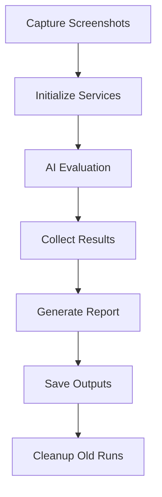

# Documentation Generation Prompt: Visual Test AI Evaluation System

Generate comprehensive MDX documentation for a static site generator covering the complete Visual Test AI Evaluation System.

---

## Documentation Structure

Create the following MDX files in `/docs/visual-testing/`:

```
docs/visual-testing/
├── index.mdx                      # Overview and quick start
├── getting-started.mdx            # Installation and setup
├── architecture.mdx               # System architecture and design
├── core-concepts.mdx              # Key concepts and terminology
├── configuration.mdx              # Configuration options
├── cli-reference.mdx              # CLI commands and options
├── api-reference.mdx              # Programmatic API
├── report-versioning.mdx          # Report management and history
├── evaluation-criteria.mdx        # AI evaluation settings
├── prompt-engineering.mdx         # Prompt templates and customization
├── examples.mdx                   # Usage examples and recipes
├── troubleshooting.mdx            # Common issues and solutions
├── best-practices.mdx             # Best practices and tips
└── changelog.mdx                  # Version history and updates
```

---

## Content Requirements for Each File

### 1. `index.mdx` - Overview and Quick Start

**Include:**
- Hero section with system description
- Key features list (7-phase pipeline)
- Architecture diagram (ASCII art or Mermaid)
- Quick start example (3-step setup)
- Navigation to other docs
- Visual examples of HTML reports

**Format:**
```mdx
---
title: Visual Test AI Evaluation System
description: AI-powered visual testing for terminal UI components
sidebar_position: 1
---

# Visual Test AI Evaluation System

> AI-powered screenshot evaluation using Claude's multimodal capabilities

## Overview

[Brief description of what the system does]

## Key Features

- 📸 **Automated Screenshot Capture** - ...
- 🤖 **AI-Powered Evaluation** - ...
- 📊 **Beautiful Reports** - ...
- 🔄 **Version History** - ...
- ⚙️ **Flexible Configuration** - ...

## Quick Start

[3-step quick start guide]

## Architecture

[High-level architecture diagram]

## Next Steps

- [Getting Started Guide](./getting-started)
- [Configuration](./configuration)
- [Examples](./examples)
```

---

### 2. `getting-started.mdx` - Installation and Setup

**Include:**
- Prerequisites (Bun, TypeScript, Anthropic API key)
- Installation steps
- Initial configuration
- First test run walkthrough
- Environment variables setup
- Verification steps

**Code Examples:**
```bash
# Installation
bun install

# Setup API key
export ANTHROPIC_API_KEY=your-key-here

# Run first test
bun test:visual
```

---

### 3. `architecture.mdx` - System Architecture

**Include:**
- Complete system architecture diagram
- 7-phase pipeline detailed breakdown:
  1. Metadata Capture
  2. AI Evaluation
  3. Prompt Engineering
  4. Result Collection
  5. HTML Reports
  6. Pipeline Orchestration
  7. CLI Integration
- Component interaction diagram
- Data flow diagram
- File structure tree
- Module dependencies

**Diagrams:**
- Use Mermaid.js for flowcharts
- ASCII art for tree structures
- Component relationship diagrams

---

### 4. `core-concepts.mdx` - Key Concepts

**Include:**
- **Screenshot Metadata**: What is captured, why it matters
- **Evaluation Criteria**: Strictness levels (lenient, moderate, strict)
- **Run Versioning**: Timestamp-based IDs, named runs
- **Report Generation**: How reports are built
- **Test Results**: Pass/fail determination
- **Confidence Scores**: What they mean
- **AI Observations**: Types of observations collected

**Format:**
```mdx
## Screenshot Metadata

Each screenshot is associated with rich metadata:

- `componentName`: Identifier for the component
- `scenarioName`: Test scenario description
- `expectation`: What the test expects to see
- `filePath`: Location of the screenshot
- `timestamp`: When it was captured
- `dimensions`: Width and height

[Example metadata JSON]
```

---

### 5. `configuration.mdx` - Configuration Options

**Include:**
- Complete `PipelineConfig` type definition
- All configuration options with defaults
- Evaluation criteria settings
- Report configuration (themes, content)
- History management settings
- Screenshot directory configuration
- Examples for common configurations

**Structure:**
```mdx
## Pipeline Configuration

### `PipelineConfig` Type

| Option | Type | Default | Description |
|--------|------|---------|-------------|
| `screenshotDir` | `string` | `"screenshots"` | Where screenshots are stored |
| `outputDir` | `string` | `"reports"` | Where reports are saved |
| ... | ... | ... | ... |

### Evaluation Criteria

[Detailed explanation of each strictness level]

### Report Themes

[Light vs Dark theme examples with screenshots]
```

---

### 6. `cli-reference.mdx` - CLI Commands

**Include:**
- All CLI commands
- Every option with description
- Examples for each option
- Combining multiple options
- Common command patterns
- Exit codes and their meanings

**Format:**
```mdx
## Commands

### `test:visual`

Run the complete visual test pipeline.

#### Options

##### `--skip-capture`
Use existing screenshots instead of capturing new ones.

**Example:**
```bash
bun test:visual --skip-capture
```

[Repeat for all options]
```

---

### 7. `api-reference.mdx` - Programmatic API

**Include:**
- How to use the system programmatically
- All exported functions and classes
- Type definitions
- Constructor parameters
- Method signatures
- Return types
- Usage examples for each API

**Classes to Document:**
- `ReportManager`
- `VisualTestEvaluator`
- `TestResultCollector`
- `HTMLReportGenerator`
- `PromptBuilder`

**Format:**
```mdx
## ReportManager

Manages report versioning, history, and cleanup.

### Constructor

```typescript
new ReportManager(config?: Partial<ReportManagerConfig>)
```

### Methods

#### `createRun(name?: string)`

Creates a new versioned report directory.

**Parameters:**
- `name` (optional): Named run identifier

**Returns:**
```typescript
{
  runId: string,
  runDir: string,
  latestDir: string
}
```

**Example:**
```typescript
const manager = new ReportManager({ keepHistory: 10 });
const { runId, runDir } = await manager.createRun("before-refactor");
```
```

---

### 8. `report-versioning.mdx` - Report Management

**Include:**
- How report versioning works
- Directory structure explanation
- Run ID format (timestamp-based)
- Named runs vs regular runs
- Cleanup behavior and rules
- Runs manifest (`runs.json`) structure
- Accessing historical reports
- Comparing runs

**Visual Examples:**
- Directory tree before/after runs
- Manifest JSON examples
- Lifecycle diagrams

---

### 9. `evaluation-criteria.mdx` - AI Evaluation Settings

**Include:**
- Detailed explanation of strictness levels
- What each criterion checks:
  - `checkTextContent`
  - `checkLayout`
  - `checkColors`
- How confidence scores work
- Custom evaluation rules
- When to use each strictness level
- Performance implications
- Cost considerations (API usage)

**Comparison Table:**
```mdx
| Strictness | Text | Layout | Colors | Use Case |
|------------|------|--------|--------|----------|
| Lenient | ✅ | ❌ | ❌ | Quick checks |
| Moderate | ✅ | ✅ | ❌ | Standard testing |
| Strict | ✅ | ✅ | ✅ | Production validation |
```

---

### 10. `prompt-engineering.mdx` - Prompts and Templates

**Include:**
- How prompts work in the system
- Available prompt templates
- Prompt variables and interpolation
- Customizing prompts
- Best practices for prompt writing
- Examples of effective prompts
- Template structure
- Adding custom evaluation rules

**Code Examples:**
```mdx
## Evaluation Prompt Template

The evaluation prompt includes:

1. Component context
2. Scenario description
3. Expectations
4. Evaluation criteria
5. Output format requirements

### Customization

```typescript
const customCriteria: EvaluationCriteria = {
  strictness: "strict",
  checkTextContent: true,
  checkLayout: true,
  checkColors: true,
  customRules: [
    "Check for proper accessibility attributes",
    "Verify responsive design at different viewports"
  ]
};
```
```

---

### 11. `examples.mdx` - Usage Examples and Recipes

**Include:**
- Complete end-to-end examples
- Common workflows
- CI/CD integration examples
- Testing strategies
- Multiple component testing
- Baseline comparison workflows
- Regression testing patterns
- Integration with existing test suites

**Example Scenarios:**
1. **Basic Component Test**
2. **Named Runs for Major Changes**
3. **CI/CD Pipeline Integration**
4. **Comparing Runs**
5. **Custom Evaluation Criteria**
6. **Batch Testing Multiple Components**
7. **Light vs Dark Theme Testing**

**Format:**
```mdx
## Example 1: Basic Component Test

### Scenario
You want to test a banner component in its default state.

### Steps

1. Create component setup file
2. Capture screenshots
3. Run evaluation
4. Review report

### Code

```typescript
// src/components/banner/banner.spec.tsx
export default {
  componentName: "banner",
  scenarios: [
    {
      scenarioName: "default",
      description: "Banner in default state",
      expectation: "Shows title and subtitle",
      Component: () => <Banner>What will you build?</Banner>
    }
  ]
};
```

```bash
bun test:visual --lenient
```

### Expected Output
[Screenshot of report]
```

---

### 12. `troubleshooting.mdx` - Common Issues

**Include:**
- TypeScript errors and fixes
- API connection issues
- Screenshot capture failures
- Evaluation failures
- Report generation errors
- Performance issues
- Cost optimization tips
- Debugging techniques

**Format:**
```mdx
## Common Issues

### Issue: "Cannot find module '@/services/AgentService'"

**Cause:** TypeScript path aliases not configured correctly.

**Solution:**
Check `tsconfig.json` paths configuration:
```json
{
  "compilerOptions": {
    "paths": {
      "@/*": ["./src/*"]
    }
  }
}
```

[Repeat for all common issues]
```

---

### 13. `best-practices.mdx` - Best Practices

**Include:**
- When to use visual testing
- How to write good test scenarios
- Naming conventions
- Directory organization
- CI/CD integration tips
- Cost management strategies
- Performance optimization
- Test maintenance
- Prompt optimization
- Report management

**Categories:**
1. **Test Design**
2. **Performance**
3. **Cost Management**
4. **Maintenance**
5. **CI/CD Integration**
6. **Team Collaboration**

---

### 14. `changelog.mdx` - Version History

**Include:**
- Version numbers
- Release dates
- New features per version
- Bug fixes
- Breaking changes
- Migration guides

**Format:**
```mdx
## Version 1.1.0 (2025-09-30)

### ✨ New Features
- Report versioning system
- Named runs support
- History management with cleanup
- Runs manifest tracking

### 🐛 Bug Fixes
- Fixed screenshot path resolution in HTML reports
- Corrected default keepHistory value

### 📝 Documentation
- Added comprehensive MDX documentation
- API reference complete

### ⚠️ Breaking Changes
- None
```

---

## MDX Formatting Guidelines

### Frontmatter

Every MDX file should include:

```mdx
---
title: [Page Title]
description: [Brief description for SEO]
sidebar_position: [Number]
tags: [visual-testing, ai, testing, evaluation]
---
```

### Code Blocks

Use language-specific syntax highlighting:

````mdx
```typescript
// TypeScript examples
const config: PipelineConfig = {...};
```

```bash
# Bash commands
bun test:visual --lenient
```

```json
// JSON examples
{
  "runId": "20250930_183027"
}
```
````

### Callouts/Admonitions

Use these for important notes:

```mdx
:::tip
Named runs are preserved indefinitely and don't count toward the history limit.
:::

:::warning
Running tests in strict mode will consume more API tokens.
:::

:::danger
Never commit your ANTHROPIC_API_KEY to version control!
:::

:::info
The default history retention is 10 runs.
:::
```

### Interactive Elements

```mdx
import Tabs from '@theme/Tabs';
import TabItem from '@theme/TabItem';

<Tabs>
  <TabItem value="lenient" label="Lenient" default>
    ```bash
    bun test:visual --lenient
    ```
  </TabItem>
  <TabItem value="moderate" label="Moderate">
    ```bash
    bun test:visual --moderate
    ```
  </TabItem>
  <TabItem value="strict" label="Strict">
    ```bash
    bun test:visual --strict
    ```
  </TabItem>
</Tabs>
```

### Mermaid Diagrams

```mdx

```

### Tables

Use markdown tables with alignment:

```mdx
| Command | Description | Example |
|:--------|:------------|:--------|
| `--skip-capture` | Use existing screenshots | `bun test:visual --skip-capture` |
| `--run-name` | Named run | `bun test:visual --run-name "v1.0"` |
```

---

## Visual Assets to Include

Create or reference these visual elements:

1. **Architecture Diagrams**
   - System overview flowchart
   - Phase pipeline diagram
   - Component interaction diagram

2. **Screenshots**
   - Example HTML reports (light/dark themes)
   - CLI output examples
   - Directory structure

3. **Code Examples**
   - Component setup files
   - Configuration examples
   - API usage examples

4. **Comparison Tables**
   - Strictness levels
   - CLI options
   - Configuration options

---

## Cross-References

Link related documentation:

```mdx
See also:
- [Configuration](./configuration) for all options
- [API Reference](./api-reference) for programmatic usage
- [Examples](./examples) for complete workflows
```

---

## Search Optimization

Include keywords in:
- Titles
- Descriptions
- Headings
- First paragraphs
- Code comments

**Keywords:**
- visual testing
- AI evaluation
- Claude
- screenshot testing
- terminal UI testing
- component testing
- automated testing
- multimodal AI

---

## Accessibility

Ensure all documentation:
- Has proper heading hierarchy (h1 > h2 > h3)
- Includes alt text for images
- Uses semantic HTML
- Has good color contrast in code blocks
- Is keyboard navigable

---

## Generate These Files

For each file, include:

1. ✅ Proper MDX frontmatter
2. ✅ Clear, structured headings
3. ✅ Code examples with syntax highlighting
4. ✅ Visual diagrams where appropriate
5. ✅ Cross-references to related docs
6. ✅ Practical examples
7. ✅ Troubleshooting tips
8. ✅ Interactive elements (tabs, callouts)
9. ✅ Search-optimized content
10. ✅ Mobile-responsive formatting

---

## Tone and Style

- **Clear and Concise**: Direct explanations without fluff
- **Example-Driven**: Show, don't just tell
- **Beginner-Friendly**: Explain concepts thoroughly
- **Professional**: Technical but approachable
- **Action-Oriented**: Use imperatives ("Run this command", "Configure these options")

---

## Final Checklist

Before considering documentation complete:

- [ ] All 14 MDX files created
- [ ] Every code example tested and verified
- [ ] All CLI options documented
- [ ] All API methods documented
- [ ] All diagrams included
- [ ] Cross-references validated
- [ ] Search keywords added
- [ ] Examples cover common use cases
- [ ] Troubleshooting covers known issues
- [ ] Best practices are actionable
- [ ] Changelog is up to date
- [ ] Navigation structure is logical
- [ ] Mobile-responsive formatting verified

---

**Start with `index.mdx` and work through each file sequentially, ensuring comprehensive coverage of the Visual Test AI Evaluation System.**
