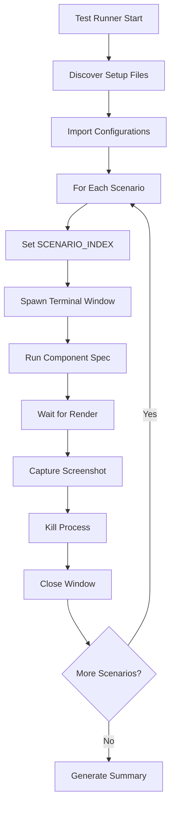

# Visual Testing System - Authoritative Documentation

> **Version**: 1.0.0
> **Last Updated**: September 30, 2025
> **Status**: Production Ready

## Table of Contents

1. [System Overview](#system-overview)
2. [Architecture](#architecture)
3. [Component Structure](#component-structure)
4. [File Specifications](#file-specifications)
5. [Test Runner](#test-runner)
6. [API Reference](#api-reference)
7. [Environment Variables](#environment-variables)
8. [Usage Guide](#usage-guide)
9. [Extending the System](#extending-the-system)
10. [Troubleshooting](#troubleshooting)
11. [Technical Requirements](#technical-requirements)

## System Overview

The Visual Testing System is a specialized framework for capturing and validating terminal-based React components rendered with OpenTUI. It automatically generates screenshots of components in various scenarios, enabling visual regression testing and documentation.

### Core Features

- **Automated Discovery**: Finds all component test specifications automatically
- **Scenario-Based Testing**: Supports multiple scenarios per component
- **Terminal Screenshot Capture**: Native macOS screenshot integration
- **Type-Safe Configuration**: Full TypeScript support with compile-time checking
- **Zero Manual Intervention**: Fully automated window management and cleanup

### System Flow



## Architecture

### Core Components

1. **Setup Files** (`*.setup.ts`)
   - Define test scenarios
   - Export configuration objects
   - Provide type definitions

2. **Spec Files** (`*.spec.tsx`)
   - Entry points for component rendering
   - Environment-aware scenario selection
   - OpenTUI render integration

3. **Test Runner** (`visualTestRunner.ts`)
   - Orchestrates test execution
   - Manages Terminal windows
   - Captures screenshots

4. **Screenshot Service** (`screenshot.ts`)
   - Terminal window automation
   - Screen capture via macOS APIs
   - Process lifecycle management

5. **Component Harness** (`componentHarness.tsx`)
   - React component mounting
   - OpenTUI integration
   - Process keep-alive mechanism

## Component Structure

### Required Directory Layout

```
src/components/
└── [component-name]/
    ├── index.tsx           # Component implementation (REQUIRED)
    ├── [name].setup.ts     # Scenario configuration (REQUIRED)
    ├── [name].spec.tsx     # Test harness entry (REQUIRED)
    └── README.md          # Component documentation (OPTIONAL)
```

### Naming Conventions

- **Component Directory**: kebab-case (e.g., `user-profile`)
- **Setup File**: `[component-name].setup.ts`
- **Spec File**: `[component-name].spec.tsx`
- **Screenshot Output**: `[component]-[scenario-name].png`

## File Specifications

### Setup File (`*.setup.ts`)

**Purpose**: Define all test scenarios for a component

**Required Structure**:

```typescript
// [component].setup.ts

const config = {
  scenarios: [
    {
      scenarioName: string,         // Unique identifier for the scenario
      description: string,          // Human-readable description
      expectation: string,          // Expected visual outcome
      params: Record<string, unknown> // Props to pass to component
    }
  ]
} as const;

// Type exports (REQUIRED)
export type [Component]Scenario = (typeof config.scenarios)[number];
export type Scenario = {
  scenarioName: string;
  description: string;
  expectation: string;
  params: Record<string, unknown>;
};

// Default export (REQUIRED)
export default config;
```

**Example Implementation**:

```typescript
// button.setup.ts

const config = {
  scenarios: [
    {
      scenarioName: "primary-default",
      description: "Primary button in default state",
      expectation: "Blue background with white text",
      params: {
        variant: "primary",
        label: "Click Me",
        disabled: false
      }
    },
    {
      scenarioName: "primary-disabled",
      description: "Primary button in disabled state",
      expectation: "Grayed out with reduced opacity",
      params: {
        variant: "primary",
        label: "Click Me",
        disabled: true
      }
    },
    {
      scenarioName: "danger-with-icon",
      description: "Danger button with warning icon",
      expectation: "Red background with warning icon on left",
      params: {
        variant: "danger",
        label: "Delete",
        icon: "warning",
        disabled: false
      }
    }
  ]
} as const;

export type ButtonScenario = (typeof config.scenarios)[number];
export type Scenario = {
  scenarioName: string;
  description: string;
  expectation: string;
  params: Record<string, unknown>;
};

export default config;
```

### Spec File (`*.spec.tsx`)

**Purpose**: Entry point for rendering a specific scenario

**Required Structure**:

```typescript
// [component].spec.tsx

import { runHarness } from "@/testing/componentHarness";
import { logger } from "@/services/logger";
import { [Component], type [Component]Props } from "./index";
import config from "./[component].setup";

// Read scenario index from environment
const scenarioIndex = Number.parseInt(process.env.SCENARIO_INDEX || "0", 10);
const scenario = config.scenarios[scenarioIndex];

// Validate scenario exists
if (!scenario) {
  logger.error(`No scenario found at index ${scenarioIndex}`);
  logger.info(`Available scenarios: ${config.scenarios.length}`);
  process.exit(1);
}

// Extract scenario data
const { scenarioName, description, params } = scenario;

// Run the test harness
runHarness({
  scenarioName,
  description,
  render: () => <[Component] {...(params as [Component]Props)} />
});
```

**Key Requirements**:

1. Must read `SCENARIO_INDEX` from environment
2. Must validate scenario exists
3. Must exit with error code if invalid
4. Must cast params to component prop type
5. Must use `runHarness` for rendering

## Test Runner

### Core Functionality

The `visualTestRunner.ts` orchestrates the entire testing process:

1. **Discovery Phase**
   - Scans for `*.setup.ts` files
   - Validates corresponding `*.spec.tsx` files exist
   - Imports configurations dynamically

2. **Execution Phase**
   - Iterates through components and scenarios
   - Sets environment variables
   - Spawns Terminal windows
   - Captures screenshots
   - Manages cleanup

3. **Reporting Phase**
   - Tracks success/failure counts
   - Generates execution summary
   - Returns appropriate exit codes

### Implementation Details

```typescript
// Core execution loop
for (const setupFile of setupFiles) {
  const specFile = setupFile.replace(".setup.ts", ".spec.tsx");
  const config = await import(setupFile);

  for (let i = 0; i < config.scenarios.length; i++) {
    await captureTerminalScreenshot({
      cmd: `SCENARIO_INDEX=${i} bun ${specFile}`,
      out: generateScreenshotPath(component, scenario),
      width: 900,
      height: 600,
      settleMs: 2000
    });
  }
}
```

## API Reference

### `runHarness(options: HarnessScenario): void`

Renders a React component in the terminal using OpenTUI.

**Parameters**:
- `scenarioName: string` - Identifier for the scenario
- `description: string` - Human-readable description
- `render: () => ReactNode` - Function returning the component to render

**Behavior**:
- Logs scenario information
- Renders the component
- Keeps process alive with `setInterval`

### `captureTerminalScreenshot(options: TerminalScreenshotOptions): Promise<void>`

Captures a screenshot of a Terminal window running a command.

**Parameters**:
- `cmd: string` - Command to execute in Terminal
- `out?: string` - Output filename (default: "terminal.png")
- `width?: number` - Window width in pixels (default: 900)
- `height?: number` - Window height in pixels (default: 600)
- `x?: number` - Window x position (default: 40)
- `y?: number` - Window y position (default: 40)
- `settleMs?: number` - Wait time before capture (default: 2500)

**Behavior**:
1. Opens new Terminal window
2. Executes command
3. Positions and sizes window
4. Waits for render
5. Captures screenshot
6. Sends Ctrl+C to kill process
7. Closes window

### `runVisualTests(options?: { pattern?: string }): Promise<void>`

Main test runner entry point.

**Parameters**:
- `pattern?: string` - Glob pattern for setup files (default: "src/components/**/*.setup.ts")

**Behavior**:
- Discovers test files
- Runs all scenarios
- Generates summary report
- Exits with appropriate code

## Environment Variables

### Runtime Configuration

| Variable | Type | Default | Description |
|----------|------|---------|-------------|
| `SCENARIO_INDEX` | number | 0 | Zero-based index of scenario to render |
| `SCREENSHOT_DELAY` | number | 2000 | Milliseconds to wait before capture |
| `TERMINAL_WIDTH` | number | 900 | Terminal window width in pixels |
| `TERMINAL_HEIGHT` | number | 600 | Terminal window height in pixels |

### Usage Examples

```bash
# Run specific scenario
SCENARIO_INDEX=2 bun src/components/button/button.spec.tsx

# Customize window size
TERMINAL_WIDTH=1200 TERMINAL_HEIGHT=800 bun src/testing/visualTestRunner.ts

# Increase render delay for complex components
SCREENSHOT_DELAY=5000 bun src/testing/visualTestRunner.ts
```

## Usage Guide

### Running All Tests

```bash
bun src/testing/visualTestRunner.ts
```

### Running Specific Component Pattern

```bash
bun src/testing/visualTestRunner.ts --pattern "src/components/button/**"
```

### Running Single Component Manually

```bash
SCENARIO_INDEX=0 bun src/components/button/button.spec.tsx
```

### Output Structure

Screenshots are saved to:
```
screenshots/
├── button-primary-default.png
├── button-primary-disabled.png
├── button-danger-with-icon.png
├── input-text-default.png
└── ...
```

## Extending the System

### Adding a New Component

1. **Create Component Structure**:
   ```bash
   mkdir -p src/components/my-component
   touch src/components/my-component/index.tsx
   touch src/components/my-component/my-component.setup.ts
   touch src/components/my-component/my-component.spec.tsx
   ```

2. **Implement Component** (`index.tsx`):
   ```typescript
   export type MyComponentProps = {
     title: string;
     isActive: boolean;
   };

   export const MyComponent = ({ title, isActive }: MyComponentProps) => (
     <box>
       <text>{title}</text>
       {isActive && <text>Active</text>}
     </box>
   );
   ```

3. **Define Scenarios** (`my-component.setup.ts`):
   ```typescript
   const config = {
     scenarios: [
       {
         scenarioName: "active-state",
         description: "Component in active state",
         expectation: "Shows title with active indicator",
         params: {
           title: "My Title",
           isActive: true
         }
       }
     ]
   } as const;

   export default config;
   ```

4. **Create Spec** (`my-component.spec.tsx`):
   ```typescript
   import { runHarness } from "@/testing/componentHarness";
   import { logger } from "@/services/logger";
   import { MyComponent, type MyComponentProps } from "./index";
   import config from "./my-component.setup";

   const scenarioIndex = Number.parseInt(process.env.SCENARIO_INDEX || "0", 10);
   const scenario = config.scenarios[scenarioIndex];

   if (!scenario) {
     logger.error(`No scenario found at index ${scenarioIndex}`);
     process.exit(1);
   }

   const { scenarioName, description, params } = scenario;

   runHarness({
     scenarioName,
     description,
     render: () => <MyComponent {...(params as MyComponentProps)} />
   });
   ```

### Adding Custom Scenario Types

For components with specific parameter requirements:

```typescript
// button.setup.ts
export type ButtonParams = {
  variant: "primary" | "secondary" | "danger";
  label: string;
  disabled: boolean;
  icon?: string;
};

const config = {
  scenarios: [
    {
      scenarioName: "primary",
      description: "Primary button",
      expectation: "Blue button",
      params: {
        variant: "primary",
        label: "Click",
        disabled: false
      } as ButtonParams
    }
  ]
} as const;
```

## Troubleshooting

### Common Issues

#### "No scenario at index X"

**Problem**: The `SCENARIO_INDEX` environment variable references a non-existent scenario.

**Solution**:
- Check the number of scenarios in the setup file
- Use a valid index (0-based)
- Run without `SCENARIO_INDEX` to use default (0)

#### Terminal Window Doesn't Close

**Problem**: The Terminal window remains open after screenshot capture.

**Solution**:
- Ensure System Events has Accessibility permission
- Check that the process is properly terminated with Ctrl+C
- Verify the AppleScript close command is executing

#### Screenshot Not Captured

**Problem**: Screenshot file is not created.

**Solutions**:
1. **Check Permissions**:
   ```bash
   # System Settings > Privacy & Security > Screen Recording
   # Add Terminal.app

   # System Settings > Privacy & Security > Accessibility
   # Add Terminal.app
   ```

2. **Verify Component Renders**:
   ```bash
   # Run spec directly to see output
   SCENARIO_INDEX=0 bun src/components/[name]/[name].spec.tsx
   ```

3. **Check File Paths**:
   ```bash
   # Ensure screenshots directory exists
   mkdir -p screenshots
   ```

#### Import Errors

**Problem**: Cannot find module or exports.

**Solutions**:
- Verify all exports in `index.tsx`
- Check import paths are correct
- Ensure TypeScript paths are configured in `tsconfig.json`

### Debug Mode

Enable detailed logging:

```typescript
// In visualTestRunner.ts
const DEBUG = process.env.DEBUG === "true";

if (DEBUG) {
  logger.setLevel("debug");
  console.log("Setup file:", setupFile);
  console.log("Config:", JSON.stringify(config, null, 2));
}
```

Run with debug:
```bash
DEBUG=true bun src/testing/visualTestRunner.ts
```

## Technical Requirements

### System Requirements

- **Operating System**: macOS 10.15 or later
- **Runtime**: Bun 1.0+ or Node.js 18+
- **Terminal**: Terminal.app (default macOS terminal)

### Required Permissions

1. **Screen Recording Permission**
   - Required for `screencapture` command
   - Grant via System Settings > Privacy & Security

2. **Accessibility Permission**
   - Required for System Events automation
   - Grant via System Settings > Privacy & Security

### Dependencies

```json
{
  "dependencies": {
    "@opentui/react": "^1.0.0",
    "glob": "^10.0.0",
    "react": "^18.0.0"
  },
  "devDependencies": {
    "@types/node": "^20.0.0",
    "typescript": "^5.0.0"
  }
}
```

### Installation

```bash
# Install dependencies
bun install

# Verify permissions
osascript -e 'tell application "System Events" to keystroke "test"'

# Run initial test
bun src/testing/visualTestRunner.ts --pattern "src/components/banner/**"
```

## Best Practices

### Scenario Design

1. **Comprehensive Coverage**
   - Test default states
   - Test error states
   - Test edge cases
   - Test with different prop combinations

2. **Clear Naming**
   - Use descriptive scenario names
   - Include state in name (e.g., "button-disabled")
   - Avoid generic names like "test1"

3. **Meaningful Expectations**
   - Document what should be visible
   - Include color, position, text details
   - Note any animations or transitions

### Performance Optimization

1. **Parallel Execution** (Future Enhancement)
   ```typescript
   // Could be implemented with worker threads
   await Promise.all(
     scenarios.map(scenario =>
       captureInWorker(scenario)
     )
   );
   ```

2. **Caching Setup Imports**
   ```typescript
   const setupCache = new Map();
   const config = setupCache.get(setupFile) ||
                  await import(setupFile);
   ```

3. **Optimized Screenshot Timing**
   - Adjust `settleMs` based on component complexity
   - Use lower values for simple components
   - Increase for data-fetching components

### Maintenance

1. **Regular Cleanup**
   ```bash
   # Clean old screenshots
   find screenshots -mtime +30 -delete
   ```

2. **Version Control**
   ```gitignore
   # .gitignore
   screenshots/*.png
   !screenshots/.gitkeep
   ```

3. **CI/CD Integration**
   ```yaml
   # .github/workflows/visual-tests.yml
   - name: Run Visual Tests
     run: bun src/testing/visualTestRunner.ts
   - name: Upload Screenshots
     uses: actions/upload-artifact@v3
     with:
       name: screenshots
       path: screenshots/
   ```

## Future Enhancements

### Planned Features

1. **Visual Regression Testing**
   - Baseline image comparison
   - Diff generation for changes
   - Approval workflow

2. **Cross-Platform Support**
   - Linux terminal emulator support
   - Windows Terminal integration
   - Docker-based rendering

3. **Enhanced Reporting**
   - HTML report generation
   - Screenshot gallery view
   - Test history tracking

4. **Performance Improvements**
   - Parallel test execution
   - Selective re-testing
   - Incremental updates

5. **Developer Experience**
   - Watch mode for development
   - Interactive scenario selector
   - VSCode extension

## License and Support

This visual testing system is part of the Aztec Agents project. For support, issues, or contributions, please refer to the main project repository.

---

*Last updated: September 30, 2025*
*System Version: 1.0.0*
*Documentation Version: 1.0.0*